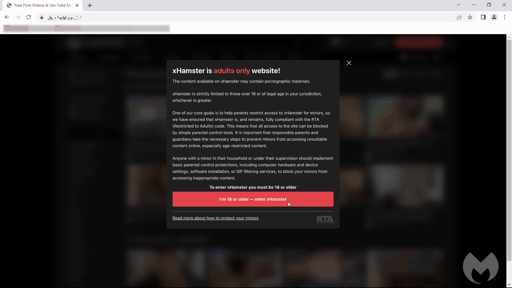

# Fake system update drops Aurora stealer via Invalid Printer loader

Malvertising seems to be enjoying a renaissance as of late, whether it is from ads on search engine results pages or via popular websites. Because browsers are more secure today than they were 5 or 10 years ago, the attacks that we are seeing all involve some form of social engineering.

A threat actor is using malicious ads to redirect users to what looks like a Windows security update. The scheme is very well designed as it relies on the web browser to display a full screen animation that very much resembles what you'd expect from Microsoft...

A Few days ago, Malwarebytes tread intelligence team [discovered](https://www.malwarebytes.com/blog/threat-intelligence/2023/05/fake-system-update-drops-new-highly-evasive-loader) a new campaign that uses a fake Windows update to drop the Aurora stealer. The attack starts with a malvertising chain that redirects users to a website displaying a fake Windows update page. The page is designed to look like the real thing, with a full screen animation that very much resembles what you'd expect from Microsoft. 

:::tip
After discovering and researching the IoC from the article, all compromised domains were added to OpenBLD.net DNSBL 🎉
:::
Part of lists you can download from [Cactusd](https://github.com/m0zgen/cactusd) 🌵 repository.

