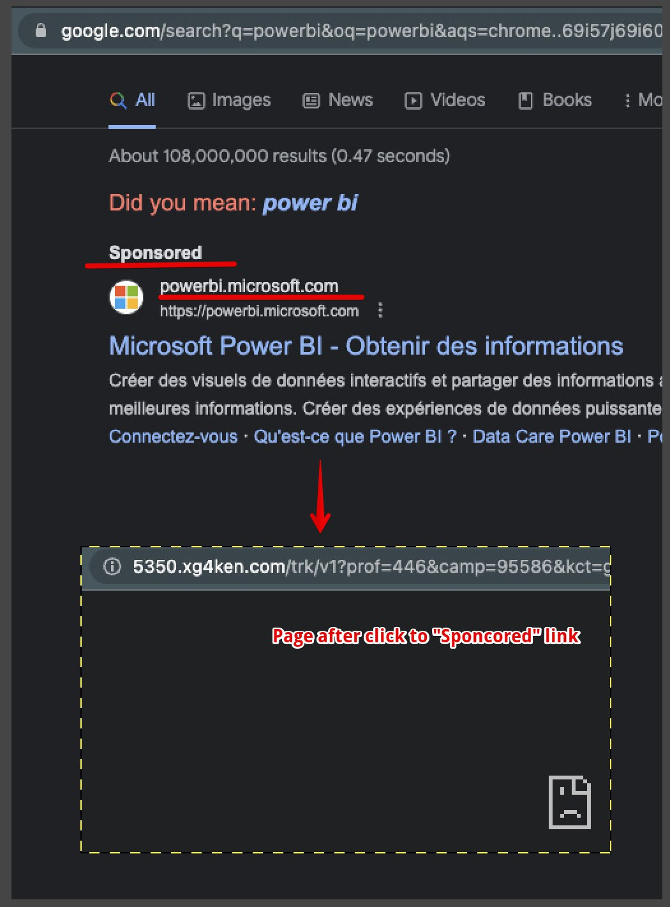

Today I discovered a new malicious company that spreads through of Google Ads side...
{/* truncate */}
In short - "Sponsored" link redirects to malicious site, and boom 💥 I felt "OpenBLD" effect!

OpenBLD.net DNS blocked for me browser-hijacking app which was distributed with Google Ads which named as`xg4ken`... 
Wow 💣, very unexpected and nice as I usually try to be more careful when surfing the internet.

What is `xg4ken` and how to [removal](https://malwaretips.com/blogs/remove-xg4ken-com/)

Be safe with free and OpenBLD.net DNS 🤜🤛️️️️️️
