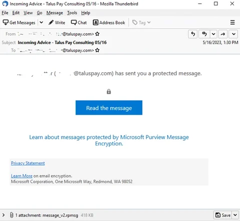

OpenBLD.net DNS Mitigated Influence from new Microsoft Encrypted Restricted Permission Messages Deliver Phishing

New phishing company described from [Trustwave](https://www.trustwave.com/en-us/resources/blogs/spiderlabs-blog/microsoft-encrypted-restricted-permission-messages-deliver-phishing/)
