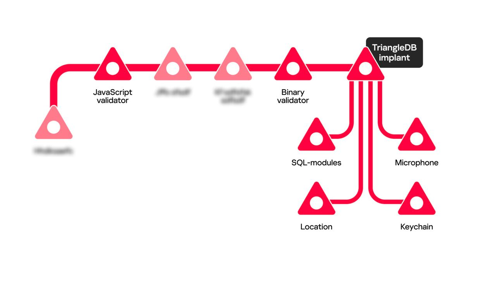

How can you reduce the threat of spying on your iPhone?

iPhone owners can be hacked through iMessage with Operation Triangulation infection chain and you can reduce thich chain attack together with OpenBLD.net.

In short. Operation Triangulation infection chain: a device receives a malicious iMessage attachment that launches a chain of exploits, and their execution ultimately results in the launch of the TriangleDB implant. In more detail, the infection chain can be summarized with the following [article](https://securelist.com/triangulation-validators-modules/110847/).

Infection chain:

Now all chained domains added to OpenBLD.net ecosystem, and of course - be careful about what and from whom you receive in your iMessage 😎
