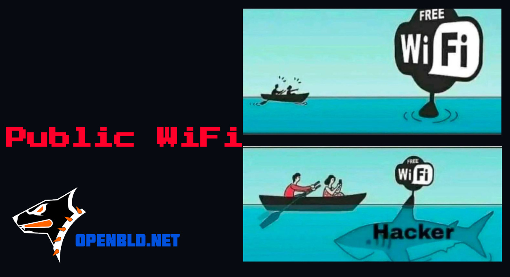

## Intro

Wi-Fi is a wireless communication technology that allows devices to connect to the internet and exchange 
data without using wired connections. Public Wi-Fi networks, available everywhere in public places such as 
cafes, airports, hotels, and shopping malls, provide users with a convenient way to access the internet 
anytime. However, such networks can pose a security threat as they are typically not password-protected and 
can be easily compromised by attackers to intercept data or launch attacks on users' devices.

## Public Wi-Fi Safety Tips

**1. Be vigilant:**

* **Don't trust public Wi-Fi networks.**
* **Verify the network name.**
    * Scammers can create fake Wi-Fi networks with similar names to steal your data.
* **Disable automatic network connection.**
    * Your device will not connect to unknown networks without your knowledge.
* **Avoid using public Wi-Fi for sensitive matters.**
    * Do not use online banking, shop, or enter passwords on websites that do not use HTTPS.

**2. Use additional security measures:**

* **Turn on a VPN.**
    * A VPN encrypts your traffic, making it unreadable to others.
    * Use only trusted and reputable VPN services.
* **Install antivirus and firewall.**
    * This will help protect your device from malware and network attacks.
* **Update your software.**
    * Make sure your device has the latest operating system and application updates installed.
* **Use two-factor authentication.**
    * This will add an extra layer of security to your accounts.

**3. Be careful what you do:**

* **Do not download files from unknown websites.**
* **Do not open suspicious links.**
* **Do not use online games and torrent clients.**

**4. Use mobile internet:**

* **If possible, use mobile internet instead of Wi-Fi.**
    * Mobile networks are generally more secure than public Wi-Fi networks.

**5. Additional tips:**

* **Use HTTPS websites.**
    * HTTPS provides a secure connection between your device and the website.
* **Disable file sharing.**
    * This will prevent other users from accessing your files.
* **Set a password for your Wi-Fi router.**
    * If you are using a mobile Wi-Fi router, be sure to set a password for it.
* **Forget the network after use.**
    * Remove the network from your device's list of known networks to prevent automatic connection.
* **Turn off Wi-Fi when not in use.**
    * This will prevent your device from connecting to unknown networks.
* **Use a secure DNS service.**
    * A secure DNS service, like Cloudflare, [OpenBLD.net](/) etc., can help protect you from phishing attacks and malware.

## Conclusion

Following these simple tips will help you protect your data and devices when using public Wi-Fi.
At least be careful and vigilant when using public Wi-Fi networks.

Remember that your security is in your hands. Take care of yourself 🔐
