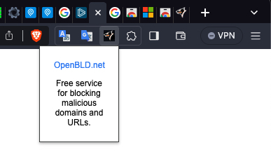

OpenBLD.net — Next Stage to Growth with Google Chrome Extension as a part of OpenBLD.net ecosystem.

I named it as [OpenBLD.net Blocker](https://chromewebstore.google.com/detail/openbldnet-blocker/jjpjcmckhkcefefgbgghomdhcbfmklea), and it is available for Google Chrome and Brave browsers (or any Chrome based browsers)

## DNS Protection with a Twist

OpenBLD.net's DNS service blocks ads, trackers, and malware through domain name filtering routines. 
However, some marketing services use JavaScript code embedded in URLs to deliver their content, 
bypassing domain-based blocking methods.

OpenBLD.net Blocker Extension - utilizes URL filtering routines to identify and block these evasive ads and trackers.

## Key Features

* Lightweight and efficient extension
* Complements OpenBLD.net service
* Adheres to Google [Manifest V3](https://developer.chrome.com/docs/extensions/mv3/intro/) standards
* Operates without relying on third-party servers or data collection
* Free from any _malicious_ or _harmful_ activities

## How to Install

* Open OpenBLD.net Blocker extension page from Google Chrome [Store](https://chrome.google.com/webstore/detail/openbldnet-blocker/jjpjcmckhkcefefgbgghomdhcbfmklea)
* In install it

After installation, you can see OpenBLD.net Blocker icon in your browser extension `chrome://extensions/` section.

* Done ✅

## Embrace Enhanced Security

With the OpenBLD.net, you can enjoy a safer and more secure online experience. 
[Setup](/docs/category/get-started/) OpenBLD.net in your [browser](/docs/category/setup-browsers/) today and experience the difference!

