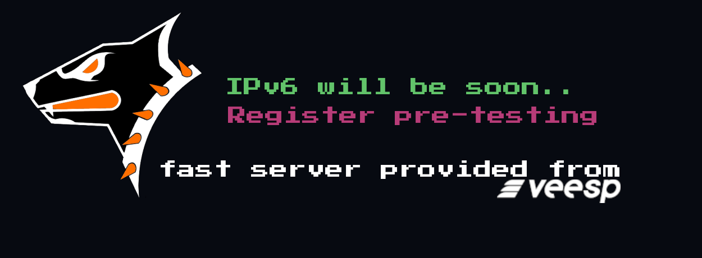

Last week, last month, this year... I've been meeting and talking to different people, and they all echoed the same sentiment - **IPv6 is needed** 💯

A few days ago, I got acquainted with [**_VEESP.com_**](https://veesp.com/), a company that generously provided OpenBLD.net with an incredibly fast server featuring a high-speed Ethernet connection 🛞

**Abstract**: Usually, I spend some time testing servers, then assign them a secondary role before introducing them to the production environment. However, this time was different...

I was so impressed 😱 with the [veesp.com](https://veesp.com/) server's speed that it practically flew into production almost immediately... )

I believe this is a great opportunity to start exploring the IPv6 space. In this month or early 2024, I hope we can begin experimenting with IPv6!

If you're ready to participate in the preliminary testing, please let me know through this [OpenBLD.net Pre-Release Testing Form](https://docs.google.com/forms/d/e/1FAIpQLSe1uHCuDcvhYeP9HCQtJySQByoPhc0koa_rCjk6UP_rxBZtNw/viewform?usp=sf_link). I will reach out to you directly when the time comes, and together we can strive to make this world even better.

P.S. Thanks to veesp.com and everyone who gives incentive to take a step forward 🤝
