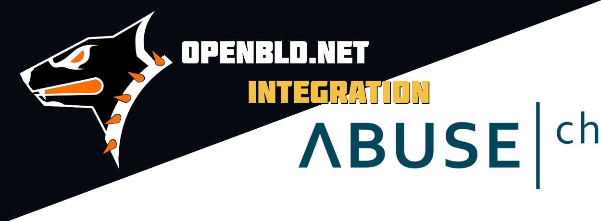

[URLhaus](https://urlhaus.abuse.ch/) is a project operated by [abuse.ch](https://abuse.ch/). Its purpose is to collect, track, and share malware URLs, aiding network 
administrators and security analysts in safeguarding their networks and customers from cyber threats.

Now, you can check the malicious domain ownership with OpenBLD.net alongside Quad9, AdGuard, Cloudflare, ProtonDNS on
[abuse.ch](https://abuse.ch/).

In addition, you can incorporate abuse.ch lists into your security solutions, just as OpenBLD.net does.

You can check this as example on:
* https://urlhaus.abuse.ch/host/licocojambamarketplace.com

## Additional Links

You can easy setup OpenBLD.net on your favourite device(s):

* [Mobile Devices](/docs/category/setup-mobile-devices/)
* [Browsers](/docs/category/setup-browsers/)
* Or you can start from here - [Get Started](/docs/category/get-started/)

Here's to security for us all. Cheers!)
