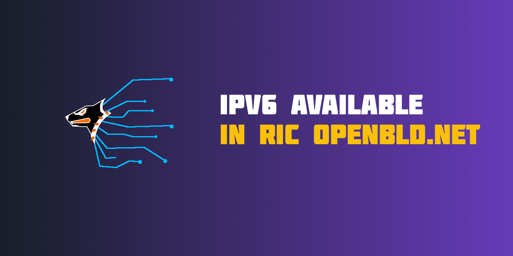

Starting today, IPv6 support has been added to the RIC OpenBLD.net ecosystem!

What does this mean for you? Now you can enjoy all the benefits of IPv6 in our network, including faster and more efficient data transmission, enhanced security, and flexibility when working with modern networks.

We are constantly striving to improve the OpenBLD.net service to provide you with the best experience possible. With the addition of IPv6 support, we are taking another step forward in ensuring you have access to the most modern technologies and capabilities.

Simply use RIC DoH or PDP DoH, and if your network supports IPv6, everything will start working automatically! 🚀

Happy browsing! 🌐
