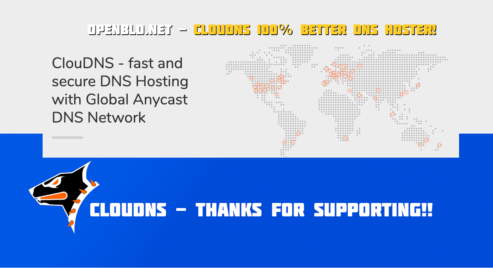

[ClouDNS.net](https://www.cloudns.net/) - fast and secure DNS Hosting service, supported OpenBLD.net in the year 2024! 🤝

### ClouDNS.net Experience

I've been using ClouDNS.net for the OpenBLD.net project for several years now. Prior to this, I've tried all the popular 
and well-known DNS services worldwide, and with 100% confidence, I want to say: 
ClouDNS.net is the best DNS hosting provider I've ever encountered.

### Key Features

- Fast
- Reliable
- Geographically distributed
- Includes built-in [monitoring](https://www.cloudns.net/monitoring/)
- [Free SSL](https://www.cloudns.net/wiki/article/441/) certificates

### Stability

I especially want to highlight the stability of ClouDNS. Throughout the entire period of usage, there hasn't been a single outage, making ClouDNS the perfect choice for OpenBLD.

I highly recommend ClouDNS to anyone looking for a high-quality DNS service.

ClouDNS.net — Thank you for your work! ✌️
