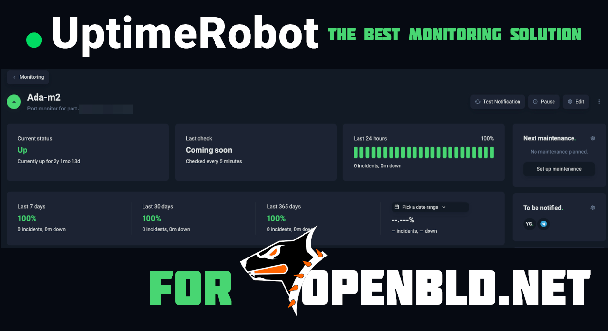

[UptimeRobot.com](https://uptimerobot.com/?rid=78534763f4713b) - The world's leading uptime monitoring service, supported OpenBLD.net in the year 2024! 🤝

### UptimeRobot Experience

UptimeRobot is the best monitoring solution for OpenBLD.net and exactly what I need:

- Multiple UptimeRobot monitoring PoPs
- Various locations worldwide
- Different monitor types (ports, protocols, etc.)
- Notifications via Telegram, Email
- One feature I especially value is the status page that displays the health of all servers in my project: bld-status.sys-adm.in

I've been using UptimeRobot for many years and have never experienced any issues with their service. Of course:

- I highly recommend UptimeRobot to anyone looking for a reliable online monitoring service.

The free plan includes 50 monitors with 5-minute checks totally free:

- Go to [UptimeRobot.com](https://uptimerobot.com/?rid=78534763f4713b).
