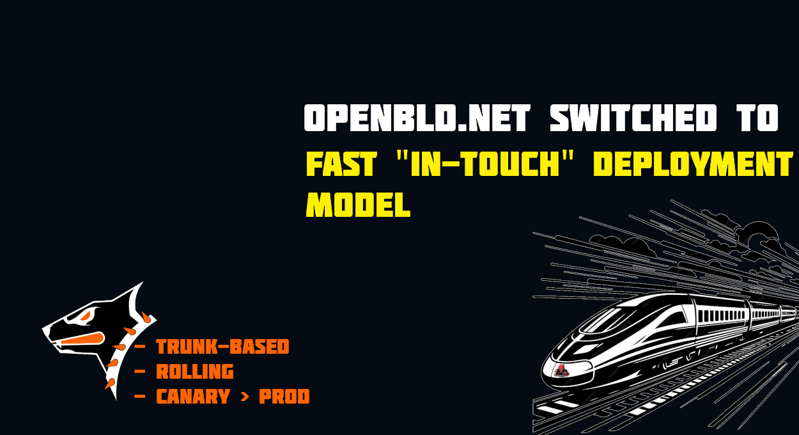

🚀 OpenBLD.net - Switched to in-touch release model

A few weeks ago I announced Canary release, now I decided switch to "in-touch" deployment stages.

To start with, I'm using my "[Flex App Additions Methodology](https://flex-doc.pages.dev/)" in my projects. Often some bugs have to be fixed quickly, we all want these bugs to be fixed quickly..)

My "in-touch" release model includes:

1. Trunk-based development model
2. Rolling release
3. Canary > Production deployment

This model can includes unnotified maintenance window ~3 minutes or 3 iteration maximum in a day, this does not mean that the service will be unavailable at this time, you just need to keep in mind that if suddenly something goes wrong for you, you immediately let me know about it, that's all)

Be patient while running, only forward!

[OpenBLD.net](https://openbld.net/) is always with you ✌️
