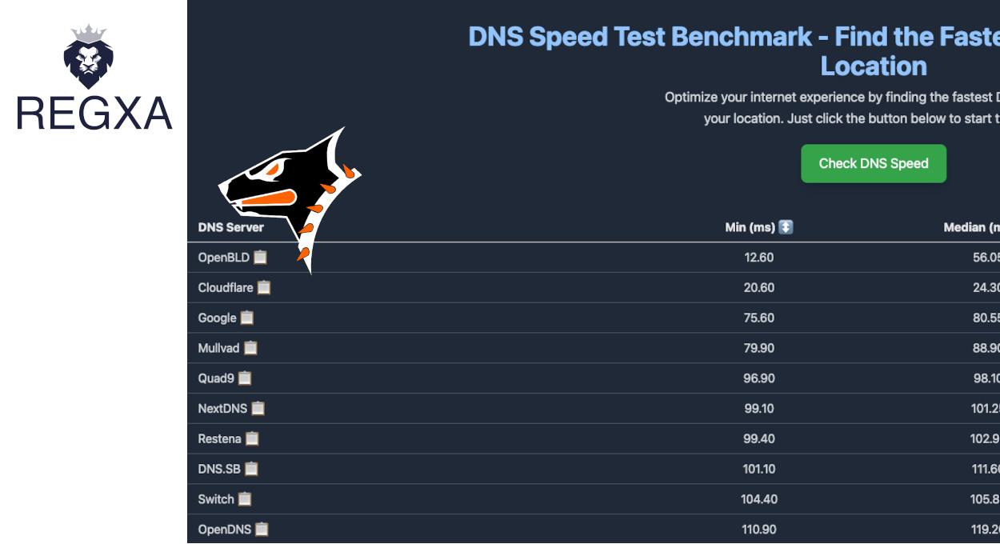

We're excited to announce that OpenBLD.net has launched a new Point of Presence (PoP) in Canada, hosted by 
[REGXA](https://regxa.com/)! 

In collaboration with [REGXA](https://regxa.com/), we also plan to establish 
two more PoPs in France and India in the next six months. I truly believe this partnership will bring 
significant benefits to everyone—enhancing the security of OpenBLD.net for our users and expanding our reach. REGXA has proven to be a reliable hosting provider, successfully handling the current load of OpenBLD.net.

Moreover, our tests indicate that the new server in Canada responds significantly faster than others. 
So, we're moving forward!

Take care, everyone! ✌️
