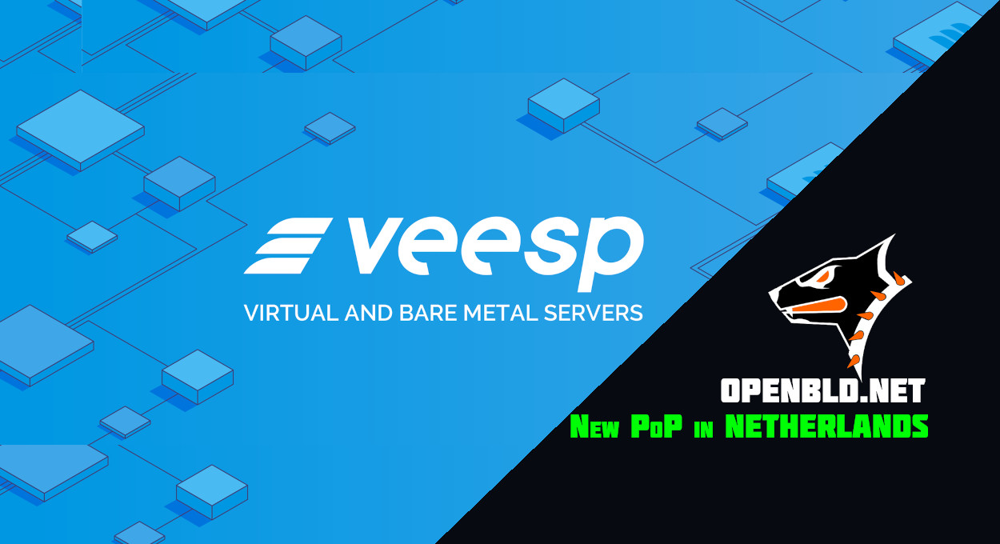

### OpenBLD.net and Veesp.com - A New PoP in the Netherlands

The open service OpenBLD.net has been collaborating with Veesp.com for two years now. As a one-stop hosting provider, Veesp.com provided a server in Latvia with 100% uptime  and fast response times 💪, and now there’s an additional server in the Netherlands!
{/* truncate */}
### Making the World a Better Place

I'm truly grateful for the people and companies that are willing to support open services like OpenBLD.net. By helping each other, we make this world a better place — I firmly believe 💯 that

Thank you, Veesp.com, for delivering quality service across Europe!

Wishing everyone peace and good fortune.

Peace ✌️
