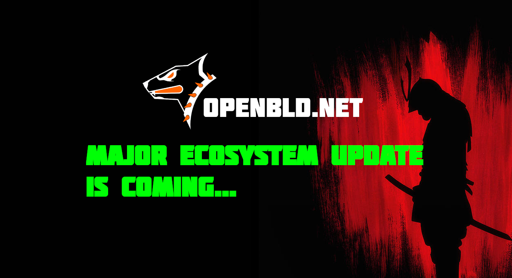

### OpenBLD.net — Major ADA System Updates 2024

The part concerning the algorithms of front-end balancing of requests has been updated. This concerns all protocols - DoT, DoH, DNS in ADA mode only

- The mechanism for blocking abusers of the service has been updated
- The modes of balancing and parallelization of requests have been updated
- The parameters of TLS and its encryption have been updated

All changes have been checked and tested in - browsers (chrome, brave), smartphones (Apple, Android) - It works!

The changes will be implemented gradually:
1. Asia
2. Europe
3. USA

The migration will be seamless and no one will notice it, but please pay attention to how everything will work - faster/slower, will there be errors in the service, etc.

I am always in touch if possible, if anything, write to me through the contacts in this chat or through the site contacts 
(see feedback section below).

### Feedback and Updates ✌️

- You can always send me feedback about the service from the contact page [feedback](/docs/contacts).
- For updates, follow the [OpenBLD.net in Telegram](https://t.me/openbld).

