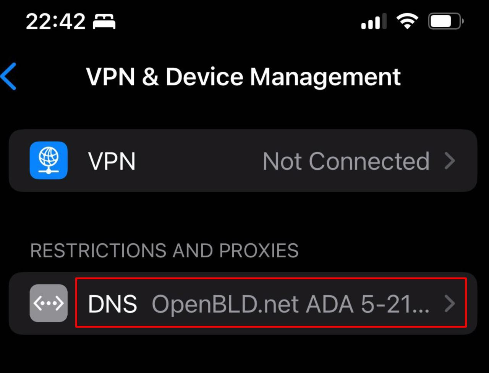

### OpenBLD.net — Enhanced Apple Profile for ADA

If you haven’t updated your profile in the last 6–12 months, do it now.

{/* truncate */}

Why you should update:

- Route optimization
- Internet issues in Kazakhstan since late 2024, causing problems with Kaspi and Alfa (store orders)
- Updated IP address infrastructure

- How to update: [Get Started](/docs/get-started/setup-mobile-devices/apple/)

P.S. Thanks to everyone reporting troubleshooting signals ✊

### Feedback and Updates ✌️

- You can always leave your feedback [here](/docs/contacts).
- Information about service updates is available in the official [OpenBLD.net Telegram Channel](https://t.me/openbld).

