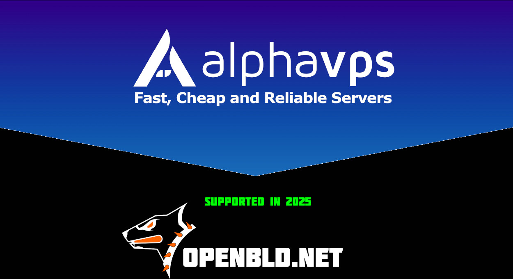

This marks the **second year of collaboration** between **OpenBLD.net** and **Alphavps.com**. Over this time, there hasn't been a single outage on their **EPYC-powered servers** in Germany and Bulgaria.
{/* truncate */}
I'm truly glad to see hosting providers that seamlessly combine **quality, speed, and affordability**—all while fully complying with **GDPR**.

🔗 Learn more: [Alphavps.com](https://alphavps.com/index.html)  
⚡ Start fast with OpenBLD in [get started](/docs/category/get-started/) section.

Big thanks to **Alphavps.com** for their continued support! 🙌

### Feedback and Updates ✌️

- Feedback [here](/docs/contacts).
- Official [OpenBLD.net Telegram Channel](https://t.me/openbld).

