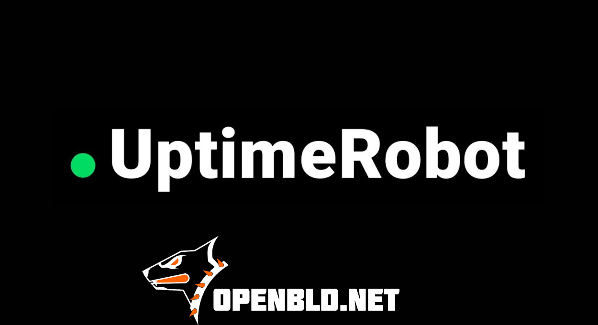

UptimeRobot.com is one of the best monitoring services: simple, stable, with global monitoring locations, and it has been supporting OpenBLD.net for several years now. 🔥

UptimeRobot sponsors premium monitoring for 200+ open-source projects and non-profits, including Arch Linux, Armbian, GlobalLeaks, and of course, OpenBLD.net!
{/* truncate */}
- If you have an open project, you can apply for sponsored monitoring from UptimeRobot.
- Or just use 50 free monitors – available to everyone!

Huge thanks to UptimeRobot.com for supporting OpenBLD.net!

Check out OpenBLD.net service status:

- [bld-status.sys-adm.in](https://bld-status.sys-adm.in/)

🤝 Helping each other makes the world a better place! Peace to all ✌️

### Updates

- Official [OpenBLD.net Telegram Channel](https://t.me/openbld).

