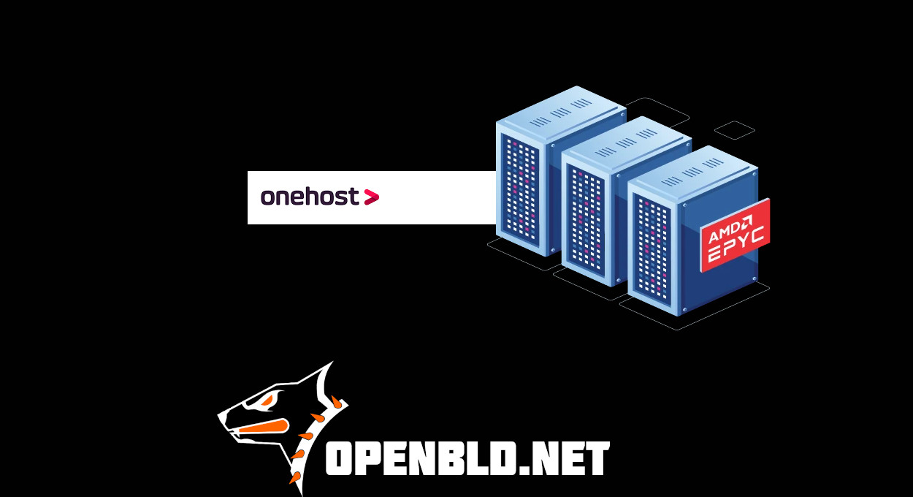

In our pursuit of improving quality, expanding the number of PoPs, and fostering national solidarity, Onehost.kz has provided a high-speed server in the Almaty region for the OpenBLD.net project.
{/* truncate */}
Previously, based on friends’ recommendations, I purchased a VPS from Onehost.kz to test compatibility with OpenBLD.net. Speed, reliability, and support—everything delivered excellent results.

Recently, I had to pause the use of the server, and without hesitation, the Onehost team offered a new server for the OpenBLD.net project. This level of support is truly commendable!

💡 Why does this matter?

Kazakhstan, Almaty, and our neighboring countries deserve high-quality internet services, fast speeds, and affordable hosting prices. This collaboration is a step toward that goal—huge thanks to everyone involved!

- Learn more about Onehost services: [Onehost.kz](https://onehost.kz/)
- [Get started](/docs/category/get-started/) with OpenBLD.net today!

Join us, don’t hesitate! Peace to all! ✌️

### Updates

- Official [OpenBLD.net Telegram Channel](https://t.me/openbld).

