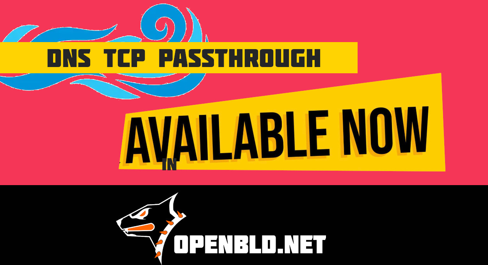

Ever wondered what happens to your DNS request over TCP when it passes through a filtering proxy or a censorship system?

Usually — it gets “downgraded” to UDP.
Because “it’s faster”... but that breaks the point..

TCP is a stream. And now, OpenBLD.net DNS is too.
{/* truncate */}
Now imagine this:

1. The client makes a TCP DNS request (e.g. DNSSEC, DoH, or just a large response)
2. It passes through the OpenBLD filter → through a UNIX socket
3. And reaches the load balancer — still over TCP

End-to-End TCP (TCP passthrough) now works across the entire path.
No downgrading, no losses, no “simplifications.”

Why is this awesome?

• Proper handling of Truncated responses or retry in case of TC=1
• Full support for large and secure DNS answers
• Guaranteed delivery from client to backend and back

With the new TCP Passthrough, requests travel from the client through OpenBLD filters and reach the backend — without cuts, without compromise.

For regular users — it just works. For those who understand — WoW!).

### Updates

- Official [OpenBLD.net Telegram Channel](https://t.me/openbld).

