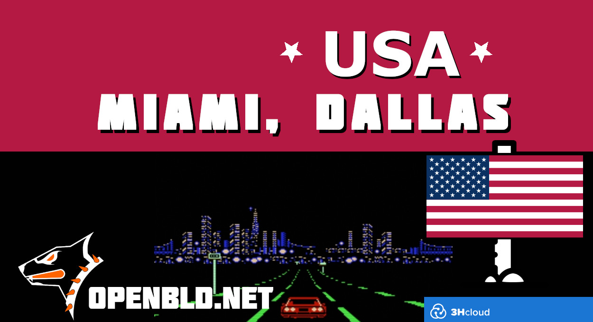

New DNS servers are now live in Miami and Dallas, USA.

Thanks to 3HCLOUD.kz, OpenBLD.net strengthens its global presence and pushes forward an independent, secure DNS ecosystem.
{/* truncate */}
✅ Faster
✅ Safer
✅ Closer to you

We believe that only together can we build a truly independent security ecosystem — including protection from DNS leaks into the hands of large corporations.

Who knows — maybe OpenBLD.net is already near you?

Connect today: [Get started](/docs/category/get-started/)

### Updates

- Official [OpenBLD.net Telegram Channel](https://t.me/openbld).

