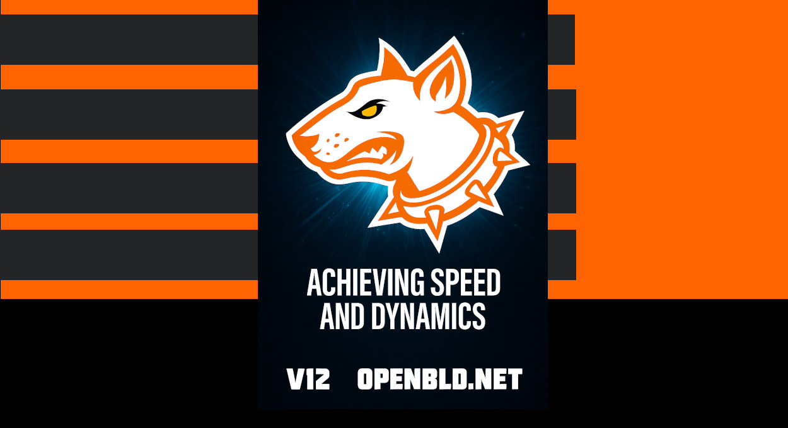

The art of speed and stability in action.

Introducing the latest update to the OpenBLD.net ecosystem, focused on performance dynamics, resilience, and predictable DNS request handling 🔄.
{/* truncate */}
🔧 What’s new:

• Optimized filters — faster than ever
• Smarter memory handling — smooth and spike-free
• Automatic CDN detection + Lua-based forwarding — intelligent routing

🚀 The result:

• Rapid warm-up
• High QPS performance — without fluctuations or drops
• Minimal latency even under heavy load 💪

💡 All of this — to make the internet cleaner, faster, and safer for all of us.

🫶 Thank you for being with OpenBLD.net

Connect today: [Get started](/docs/category/get-started/)

### Updates

- Official [OpenBLD.net Telegram Channel](https://t.me/openbld).

