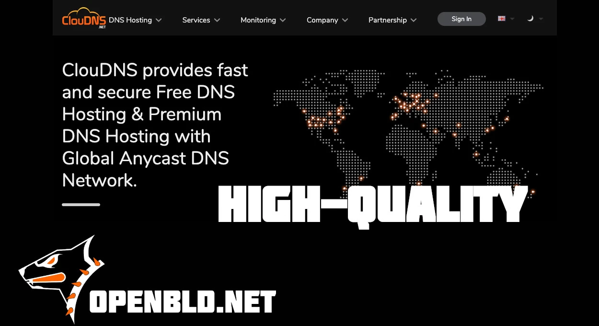

[ClouDNS](https://www.cloudns.net/) is a reliable, fast ⚡, and accessible platform for DNS hosting. With a global network of points of presence, instant DNS updates, and powerful [GeoDNS](https://www.cloudns.net/geodns/) capabilities, it enables flexible and adaptive DNS management in today’s fast-paced Internet environment.
{/* truncate */}
OpenBLD joined ClouDNS back in 2023 — and since then, the service has proven itself as a stable and trusted foundation for all of DNS and GeoDNS infrastructure.

I'm truly happy to continue this collaboration. Without ClouDNS, OpenBLD would not have become the service it is today — and I’m very grateful for that.

-  Looking for high-quality DNS hosting? - https://www.cloudns.net
-  Looking for an Internet without ads and trackers? - [Connect today](/docs/category/get-started/)

### Updates

- Official [OpenBLD.net Telegram Channel](https://t.me/openbld).

