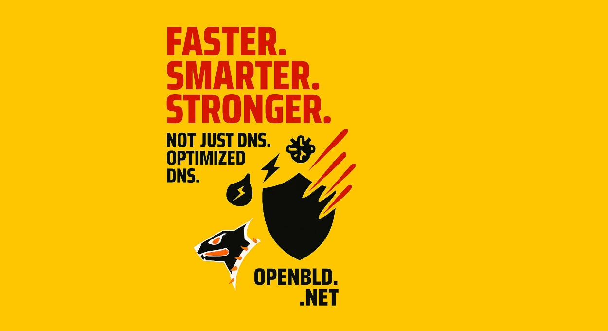

**New version released**: Not just faster DNS — every unnecessary millisecond is gone.
{/* truncate */}
What’s new under the hood:

-  Improved protection against Slowloris attacks
-  Tuned timeouts and smarter TLS session handling
-  Smarter memory management (zero alloc 💥)
-  Buffer operation optimization = fewer pauses
-  Reduced UDP fragmentation across the OpenBLD.net ecosystem

All for one thing: faster, cleaner, more reliable DNS 🥷

Maybe it’s not your internet that’s slow — maybe it’s your DNS?

Try OpenBLD on Android, iOS, browsers, Linux, and Windows:

- ⚡ [Connect to OpenBLD.net](/docs/category/get-started/)

### Updates

- Official [OpenBLD.net Telegram Channel](https://t.me/openbld).

