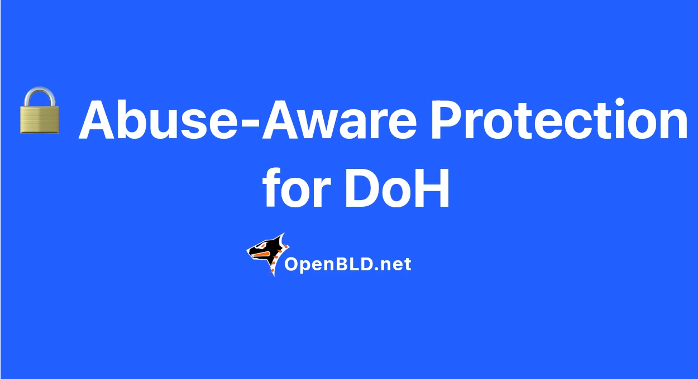

🔄 Next week we’re enabling smart rate limiting on all OpenBLD DoH servers
{/* truncate */}
Automatic detection and blocking of anomalies without affecting legitimate traffic.

This won’t affect current users in any way (unless you’re an abuser).
But if something goes wrong, please let me know: @sysadminkz

Thanks to everyone using OpenBLD.net! ✌️

Stay connected: ⚡ [OpenBLD.net](/docs/category/get-started/)

### Updates

- Official [OpenBLD.net Telegram Channel](https://t.me/openbld).

