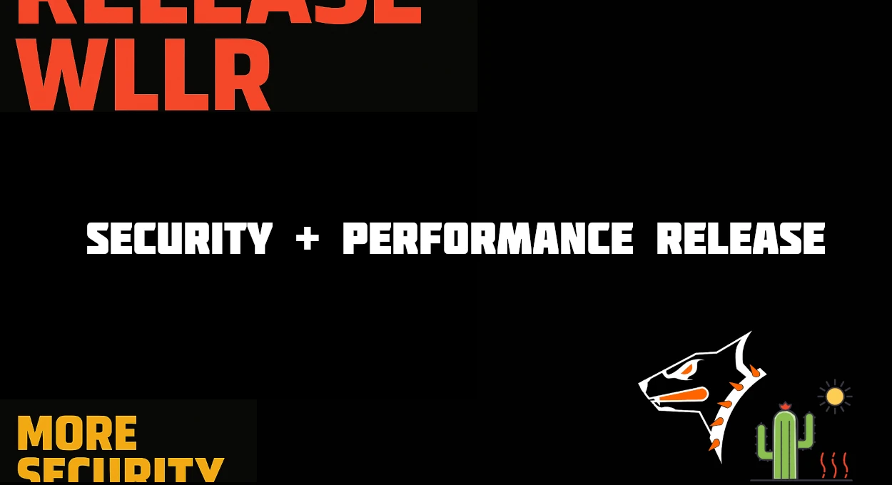

🔄 The new release, codenamed Wllr, makes the DNS filter even faster and more reliable.
{/* truncate */}
+  New strict hostname validator (RFC 1035/1123): non-standard and suspicious names are blocked immediately.
+  Optimized signature loading: updates are now faster and more stable.
+  Fast troubleshooting logging in hot paths: higher QPS without extra overhead.
+  Performance has caught up with Gram — which was the fastest release of the year thanks to fewer security checks.

⚡ The combination of speed and security is what we put into every release.

Keep evolving with OpenBLD.net 🚀

### Updates

- Official [OpenBLD.net Telegram Channel](https://t.me/openbld).

