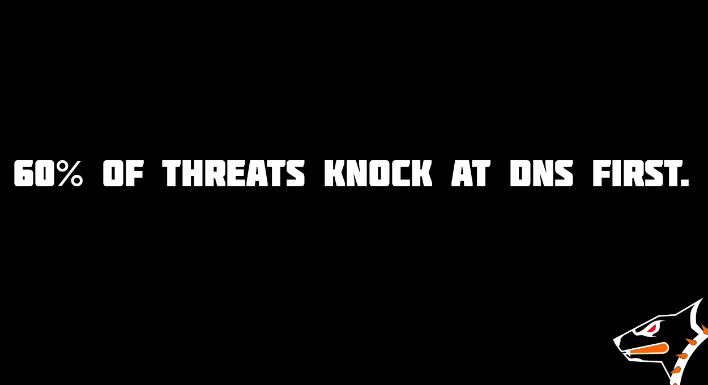

OpenBLD — DNS filtering continues to be strengthened, evolving into a reliable security layer rather than just a resolver.
{/* truncate */}
Over the past weeks several core mechanisms have been enhanced:

- Validator ASCII — strict domain validation based on RFC standards
- Abuse Module — fast blocking of suspicious sources
- Rated Module — added sharding to protect against overload and DoS
- Unicode Detector — preparing basic protection against IDN homograph attacks and phishing

DNS is not only about speed — it’s a Security Assistant, quietly protecting users every day.

🚀 OpenBLD.net — the evolution of DNS security continues. Get started [here](/docs/category/get-started/).

ℹ️ The update will be rolled out across all ADA instances within the upcoming weeks.

### Updates

- Official [OpenBLD.net Telegram Channel](https://t.me/openbld).

