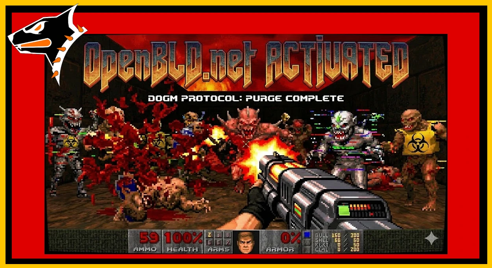

After six months of tuning the monitoring and DGA-domain blocking system,
along with the rollout of the updated RTL release, it’s time to cut dynamic noise out of the main traffic flow.
{/* truncate */}
What this means in practice:

- Real-time blocking of suspicious domains
- Dropping junk DNS packets at the edge
- Reactive bans for aggressive IP addresses

⚠️ Important: DOGM is being rolled out gradually. In rare cases, false positives may occur.
For such situations, feedback is available [here](/docs/contacts).

Take what you need — and cut off everything you don’t.

Peace ✌️

### Updates

- Official [OpenBLD.net Telegram](https://t.me/openbld).

