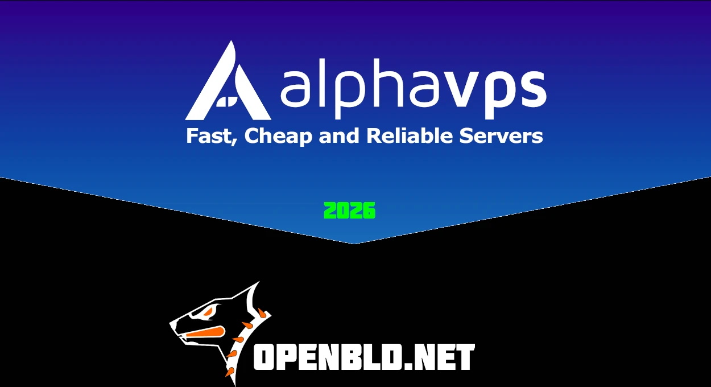

2026 is a great moment to look back and sum things up.
Three years of stable operation. Three years of continuous support. Three years with zero failures.

[Alphavps](https://alphavps.com/) continues to support OpenBLD.net, and this is an important infrastructure milestone.

Over the years, [Alphavps](https://alphavps.com/) has proven itself as a Fast & Cheap VPS provider — exactly as stated on their official website.
{/* truncate */}
In production, OpenBLD relies on VPS instances powered by [AMD EPYC](https://alphavps.com/high-performance-vps.html), deployed in Germany and Bulgaria. This infrastructure enables fast and reliable DNS services for:

- Germany
- Bulgaria
- Greece
- Romania
- Moldova
- Turkey
- and neighboring regions

Throughout these years, the infrastructure has consistently demonstrated:

- stability under load
- predictable and low latency
- fair and reliable SLA
- no surprises or performance degradation

For network services and DNS infrastructure, this is what truly matters.

- More details: https://alphavps.com/

Thank you, Alphavps, for stability, trust, and long-term partnership.

### Updates

- Official [OpenBLD.net Telegram](https://t.me/openbld).

