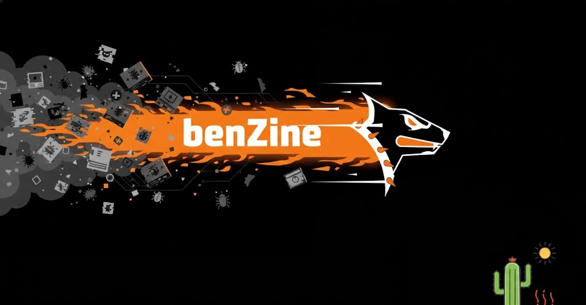

While you were sleeping (or maybe not), I rebuilt the “engine” of our update system.
Meet benZine — the fuel that hunts malicious DNS signatures all over the world and pumps them straight into OpenBLD servers.

#### So, what’s changed?
Over the past year, benZine has evolved from a simple script into a powerful ecosystem. The code has been rewritten and delivery fully optimized — now:

- Millions of domains are processed in just a couple of minutes
- Updates reach servers in seconds
{/* truncate */}
Why does this matter for you, me, and all of us?

Before, after a server restart or a database update, there was a small “window” where fresh internet noise could slip through. 
That window is now closed. Security policies are applied almost instantly.

OpenBLD.net is becoming not just cleaner — but faster.
We remove digital junk before it even has a chance to think about our traffic) 🔥

Thanks for riding along with OpenBLD.net.

More to come. Peace! ✌️

### Updates

- Official [OpenBLD.net Telegram](https://t.me/openbld).

