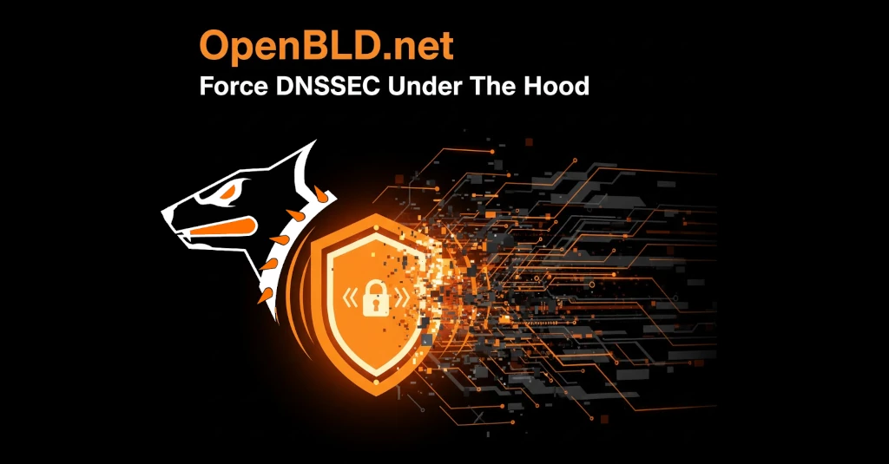

A lot has been achieved over the years, but this past month we’ve rolled out a major update: 
forced domain digital signature verification (DNSSEC) at the deepest levels of the OpenBLD ecosystem.
{/* truncate */}
What does this give us?

- +1 Protection against domain spoofing.
- +1 Resilience to attacks. 
- +1 Security Karma for the whole OpenBLD project.

Security shouldn’t slow you down. That’s why these changes are implemented to ensure top-tier protection stays perfectly in sync with high-speed performance.

This is one more step towards:

- Independence from public DNS monopolists.
- Enhanced privacy.
- Building our own secure, self-sustained infrastructure.

It’s another big plus: +1 to Independence and Privacy 🥷

Stay safe. Peace! ✌️

### Updates

- Official [OpenBLD.net Telegram](https://t.me/openbld).

