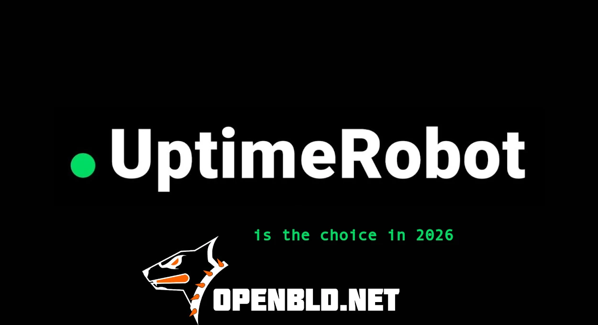

This is one of those cases when a service truly becomes part of your infrastructure.

Honestly, for me, it’s a clear choice.

{/* truncate */}

### Why

- [x] 50 free monitors
- [x] 20+ integrations
- [x] Real-time alerts (web, mobile, Telegram, and more)
- [x] Public status pages
- [x] A new interface — clean, fast, and convenient
- [x] Most importantly — a responsive and friendly UptimeRobot team

---

### OpenBLD.net uptime status

According to the public status page, OpenBLD.net demonstrates the following availability:

| Period        | Uptime   |
|---------------|----------|
| Last 24 hours | 100.000% |
| Last 7 days   | 99.971%  |
| Last 30 days  | 99.984%  |
| Last 90 days  | 99.983%  |

👉 OpenBLD Status:  
https://bld-status.sys-adm.in/

---

Thank you to the UptimeRobot team for your trust and continued support 🤝

### Updates

- Official [OpenBLD.net Telegram](https://t.me/openbld)
