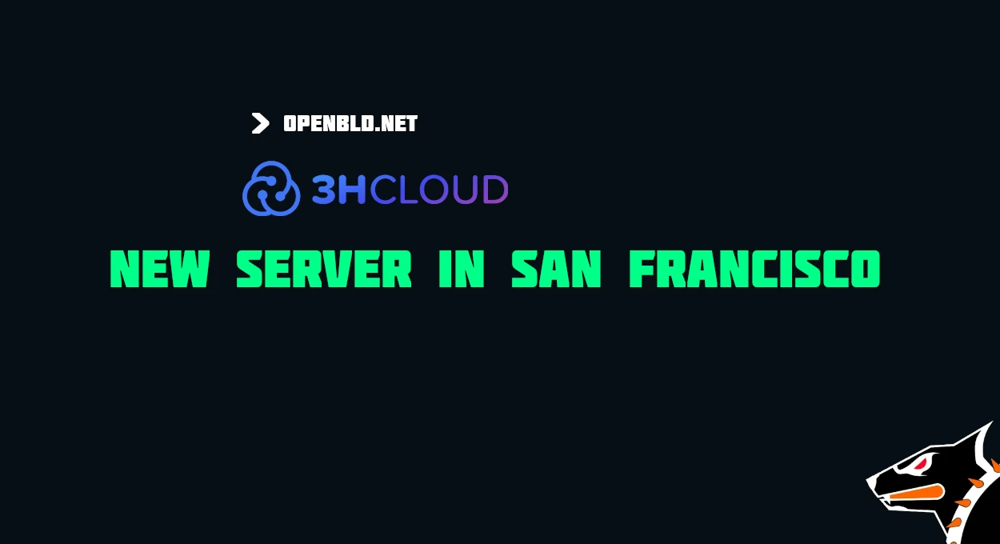

Thanks to [3HCLOUD.kz](https://3hcloud.kz/), a new OpenBLD infrastructure server has been deployed in San Francisco.

Over the years of working together, 3HCLOUD has consistently demonstrated:

- Stable and reliable services
- Very competitive pricing
- Multiple locations worldwide, including Kazakhstan 🇰🇿
- Built-in firewall and additional security features
- Fast and high-quality network connectivity

{/* truncate */}

Throughout the development of [OpenBLD.net](https://openbld.net/), we have worked with many cloud providers. Not all of them are able to meet the demands of DNS infrastructure.

_You could say that OpenBLD.net has become a kind of stress test for cloud platforms._

That is why it is especially rewarding to highlight that [3HCLOUD](https://3hcloud.kz/) has been successfully passing this test for many years.

Together, we are making the Internet faster, safer, and more reliable.

Thank you to the [3HCLOUD.kz](https://3hcloud.kz/) team for supporting the project. 🤝

---

#### Updates

- Official [OpenBLD.net Telegram](https://t.me/openbld)
