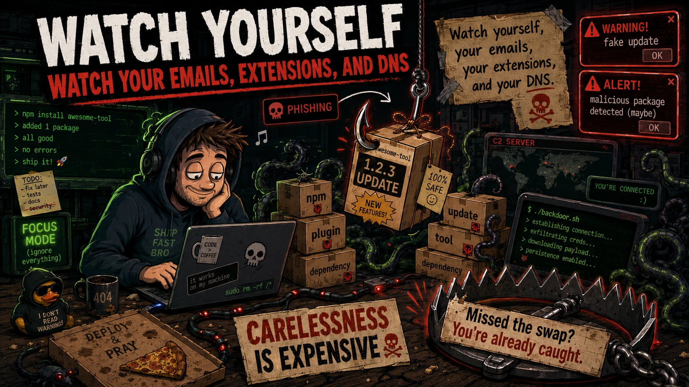

Recent supply chain incidents are a strong reminder that modern attacks often start through tools and workflows developers already trust:

- npm packages and dependency updates
- compromised maintainer accounts
- VSCode extensions
- GitHub Actions workflows
- developer tools
- fake installers and update mechanisms

{/* truncate */}

Several recent cases highlight this trend:

- Axios compromised on npm — malicious versions dropped a Remote Access Trojan [>](https://www.stepsecurity.io/blog/axios-compromised-on-npm-malicious-versions-drop-remote-access-trojan)
- Compromised VSCode Nx Console [>](https://github.com/nrwl/nx-console/security/advisories/GHSA-c9j4-9m59-847w)
- OpenAI response to the TanStack npm supply chain attack [>](https://openai.com/index/our-response-to-the-tanstack-npm-supply-chain-attack/)
- OpenAI response to the Axios developer tool compromise [>](https://openai.com/index/axios-developer-tool-compromise/)
- GitHub reported an investigation into unauthorized access to internal repositories [>](https://x.com/github/status/2056884788179726685)
- Grafana supply chain ransomware incident [>](https://grafana.com/blog/grafana-labs-security-update-latest-on-tanstack-npm-supply-chain-ransomware-incident/)

The key takeaway: supply chain attacks are becoming more relevant to every developer, engineering team, and company.

**DNS security should not be treated as an optional layer.**

It can provide visibility and control when malicious code attempts to:

- connect to C2 infrastructure
- download additional payloads
- reach phishing domains
- communicate with fake update servers
- exfiltrate data through suspicious endpoints

If malicious code has already entered the environment, visibility becomes critical...

At this point, the key questions are simple:

- **Can you see where it is trying to connect?**  
- **Can you understand whether that connection is expected?**  
- **Can you react before the incident becomes bigger?**

OpenBLD.net — Security starts earlier than incident response.

Watch yourself, your emails, your extensions, and your DNS.

---

#### Updates

- Official [OpenBLD.net Telegram](https://t.me/openbld)
