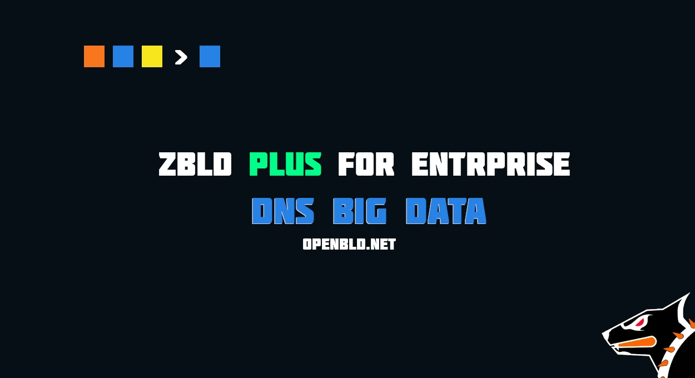

The solution is available for On-Premise deployments and is designed for organizations that require detailed DNS analytics, 
full control over their data, and event storage within their own infrastructure.

Centralized DNS event collection with ClickHouse and VictoriaLogs integration.
{/* truncate */}
* centralized collection of DNS events from all zBLD instances;
* streaming data delivery to ClickHouse or VictoriaLogs;
* analytics for queried and blocked domains;
* the option to disable IP address anonymization;
* data storage and processing entirely within the customer’s infrastructure.

ClickHouse makes it possible to process large volumes of DNS events, run queries across any time range, and generate aggregated statistics by users, nodes, domains, query types, and processing results.

This is the next step in the evolution of DNS cybersecurity.

**zBLD Plus for Enterprise is offered as an On-Premise solution for organizations.**

For individual users and the wider community, **OpenBLD Public DNS is available free of charge:**

https://openbld.net/

#### Updates

- Official [Telegram](https://t.me/openbld)
