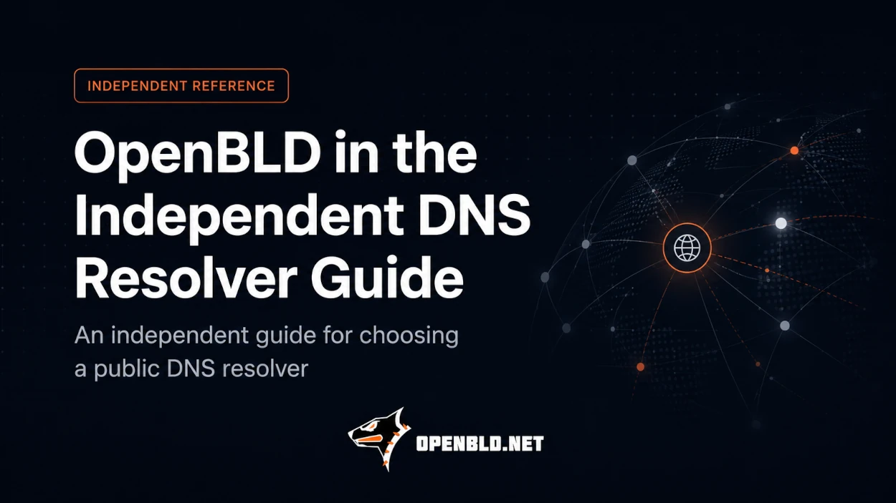

## OpenBLD in the Independent DNS Resolver Guide

Choosing a public DNS resolver today is about much more than picking between Google and Cloudflare.

There are dozens of public DNS services: global and regional providers, commercial services, non-profits, and community-run projects. 
They differ in privacy policies, filtering capabilities, DNSSEC support, encrypted DNS protocols, infrastructure locations, and logging practices.

Comparing all of them can be difficult.

{/* truncate */}

This is where the [EvilBit DNS Resolver Guide](https://evilbit.de/dns-resolver-guide.html) comes in - an independent online guide for choosing a public DNS resolver.

The guide brings together public DNS providers from different countries and jurisdictions and makes it easier to compare their features, supported protocols, filtering options, DNSSEC and IPv6 support, logging policies, and other characteristics.

It also includes an interactive resolver selector and latency testing for supported DNS-over-HTTPS services.

## OpenBLD is now listed

OpenBLD has recently been added to the DNS Resolver Guide.

The project is listed under **Smaller, community-run, and regional resolvers**, alongside other independent and regional DNS services.

That feels like a natural place for OpenBLD.

OpenBLD is an independent community-run project from 🇰🇿 Kazakhstan, providing a free protective public DNS service with several filtering profiles.

The guide describes OpenBLD as offering ADA and RIC profiles, ad, tracker, and malware filtering, URLhaus threat intelligence, DoH, DoT, and DNSSEC support.

Beyond external threat intelligence such as URLhaus, OpenBLD also uses its own zBLD detection mechanisms to identify suspicious DGA-generated domains in real time.

The infrastructure also includes IP anonymization in DNS logs and statistics.

The free public service is rate-limited to approximately 100,000 DNS queries per day per user.

In August 2026 alone, the OpenBLD public DNS infrastructure has processed more than **6 billion DNS queries** — with live statistics [available](/#live-stats) on the OpenBLD website.

## Why independent DNS directories matter

There is no single DNS resolver that is best for everyone.

For one user, latency may be the most important factor. For another, it may be logging policy or jurisdiction.

Others may care about malware and phishing protection, family filtering, DNSSEC, encrypted DNS, or how close the resolver infrastructure is to them.

Independent directories and comparison projects are useful because they do not have to decide which DNS provider is “the right one” for you.

They give you the information needed to make your own choice.

We are glad that OpenBLD is now one of those choices - representing an independent DNS project from 🇰🇿 Kazakhstan.

**The internet starts with DNS. And it is good to have a choice.**

#### Updates

- Official [Telegram](https://t.me/openbld)
