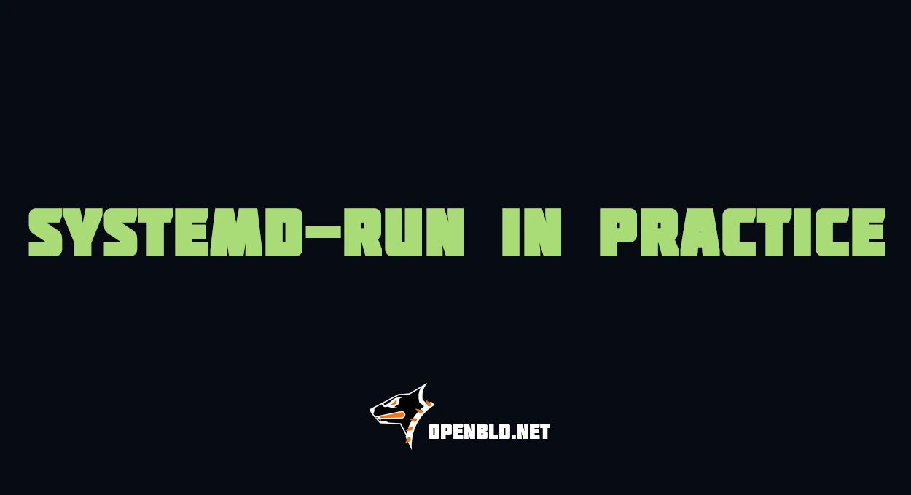

# systemd-run in Practice: Scheduling, Sandboxing, cgroups, and Automation

When you need to run a one-off task in the background or schedule a maintenance script for later, the usual tools that come to mind are `nohup`, `screen`, `at`, or `cron`.

But if your servers already use systemd, you also have access to a much more powerful tool: `systemd-run`.

It creates **transient units** — temporary services and timers that do not require permanent `.service` or `.timer` files.

With transient units, you can get proper process supervision, journald logging, cgroup resource limits, sandboxing, scheduling, and status tracking without adding permanent systemd configuration.

Let’s look at a few practical use cases.
{/* truncate */}
## 1. One-off scheduling without cron or at

Suppose you need to restart a service at 4 AM, when traffic is low.

Creating a permanent timer or adding a temporary cron entry for a one-time operation is unnecessary.

You can schedule it directly:

```bash
sudo systemd-run --on-calendar="04:00:00" /bin/systemctl restart zbld
```

You can also use an exact date and time:

```bash
sudo systemd-run \
--on-calendar="2026-08-27 04:00:00" /bin/systemctl restart zbld
```

For relative scheduling, such as running something two hours from now:

```bash
sudo systemd-run --on-active="2h" /usr/local/bin/cleanup-script.sh
```

### Why use this instead of cron?

A few useful advantages:

- **Centralized logging** — stdout and stderr are available through `journalctl`.
- **Process supervision** — systemd tracks the process and its exit status.
- **Visibility** — scheduled transient timers can be inspected with:

```bash
systemctl list-timers
```

- **No permanent configuration files** — useful for one-off maintenance tasks.

One important detail: transient units created with `systemd-run` do **not survive a reboot**.

If you need a timer that survives reboots and catches up on missed executions, use a persistent `.timer` unit with:

```ini
Persistent=true
```

That behavior belongs to persistent systemd timers, not transient timers created with `systemd-run`.

## 2. Controlling resource-heavy tasks with cgroups

A common operational problem is a maintenance or analytics script unexpectedly consuming too much CPU or memory.

For example, a statistics aggregation job, log processor, database export, or domain-analysis script may interfere with production workloads.

`systemd-run` can place the process directly into a dedicated cgroup and apply resource controls:

```bash
sudo systemd-run \
  --property=MemoryMax=500M \
  --property=CPUWeight=20 \
  --property=IOWeight=10 \
  /opt/scripts/heavy_analytics.py
```

Here:

- `MemoryMax=500M` sets a hard memory limit for the unit.
- `CPUWeight=20` gives the process a relatively low CPU scheduling weight.
- `IOWeight=10` gives it a relatively low I/O scheduling weight.

The CPU and I/O weights matter primarily when multiple workloads are competing for the same resources.

The process is not limited to a fixed percentage of CPU. Instead, it receives a lower relative share compared with workloads that have higher weights.

If the process and its child processes reach the `MemoryMax` limit, systemd may trigger an OOM event inside that unit.

This is much safer than launching a potentially expensive script directly on a production host.

## 3. Sandboxing untrusted or experimental code

Another useful feature is applying systemd security controls to a process without creating a permanent service definition.

For example:

```bash
sudo systemd-run \
  --property=PrivateTmp=yes \
  --property=ProtectSystem=strict \
  --property=ProtectHome=yes \
  /tmp/test_binary
```

This gives the process a significantly more restricted environment.

`PrivateTmp=yes` provides isolated `/tmp` and `/var/tmp` directories.

`ProtectSystem=strict` makes most of the filesystem read-only from the process perspective.

`ProtectHome=yes` hides locations such as:

```text
/home
/root
/run/user
```

from the process.

You can continue hardening the unit with additional systemd properties.

For example:

```bash
sudo systemd-run \
  --property=PrivateTmp=yes \
  --property=ProtectSystem=strict \
  --property=ProtectHome=yes \
  --property=NoNewPrivileges=yes \
  --property=PrivateDevices=yes \
  /tmp/test_binary
```

This is not a replacement for a container or VM when strong isolation is required, but it is extremely convenient for reducing the privileges and filesystem visibility of temporary processes.

## 4. Fire-and-forget jobs with Ansible

When managing multiple servers with Ansible, sometimes you need to start a long-running operation across many nodes without making the playbook wait for every process to finish.

For example:

- log processing
- report generation
- cache rebuilding
- maintenance jobs
- large cleanup operations

Ansible has its own asynchronous execution mechanisms, but another approach is to delegate process management to systemd.

Example:

```yaml
- name: Run heavy maintenance script in background via systemd-run
  ansible.builtin.command:
    cmd: >
      systemd-run
      --unit=node-maintenance-{{ ansible_date_time.epoch }}
      --collect
      --property=CPUWeight=30
      /opt/maintenance/deep_clean.sh
  become: true
```

This provides several useful properties.

The playbook only waits for `systemd-run` to create and start the transient service. It does not wait for `deep_clean.sh` itself to finish.

Each execution receives a unique unit name:

```text
node-maintenance-1756154220.service
```

The process gets its own cgroup and resource policy.

The `--collect` option allows systemd to unload the transient unit after it has finished and no longer needs to be referenced.

You can still inspect a running task using:

```bash
systemctl status node-maintenance-1756154220.service
```

And view its logs with:

```bash
journalctl -u node-maintenance-1756154220.service
```

This is often much easier to operate than a detached process started with:

```bash
nohup /opt/maintenance/deep_clean.sh > /tmp/deep-clean.log 2>&1 &
```

With `systemd-run`, the task has a name, lifecycle, journal, exit status, cgroup, and resource controls.

## 5. Giving background jobs meaningful names

By default, systemd will generate a transient unit name automatically.

For operational tasks, explicitly naming the unit makes troubleshooting much easier:

```bash
sudo systemd-run \
  --unit=database-cleanup \
  /opt/scripts/database-cleanup.sh
```

Now you can immediately inspect it:

```bash
systemctl status database-cleanup.service
```

or follow its logs:

```bash
journalctl -fu database-cleanup.service
```

For recurring automation systems such as Ansible, adding a timestamp or another unique identifier prevents unit-name collisions:

```bash
--unit=node-maintenance-$(date +%s)
```

## 6. Running a command with an automatic runtime limit

Another useful pattern is preventing maintenance jobs from running forever.

For example:

```bash
sudo systemd-run \
  --unit=stats-rebuild \
  --property=RuntimeMaxSec=30m \
  /opt/scripts/rebuild-stats.sh
```

If the process is still running after 30 minutes, systemd will stop the unit.

This is useful for jobs that are expected to complete within a predictable amount of time.

You can combine it with resource limits:

```bash
sudo systemd-run \
  --unit=stats-rebuild \
  --collect \
  --property=RuntimeMaxSec=30m \
  --property=MemoryMax=1G \
  --property=CPUWeight=25 \
  /opt/scripts/rebuild-stats.sh
```

Now the job has:

- a clear unit name
- a maximum runtime
- a memory limit
- reduced CPU priority
- journald logging
- automatic unit cleanup

all without creating a permanent `.service` file.

## A practical one-liner

A useful general-purpose maintenance pattern looks like this:

```bash
sudo systemd-run \
  --unit=one-shot-maintenance \
  --collect \
  --property=MemoryMax=1G \
  --property=CPUWeight=25 \
  /opt/scripts/maintenance.sh
```

Instead of an anonymous background PID, you get a managed process with a name, logs, resource limits, status, exit code, and a clear lifecycle.

## Final thoughts

Transient systemd units are one of those tools that are easy to overlook.

For permanent services and recurring schedules, normal `.service` and `.timer` units are still the right choice.

But for one-off operations, background maintenance, resource-controlled scripts, temporary sandboxing, or automation from tools such as Ansible, `systemd-run` can be considerably cleaner than `nohup`, `screen`, temporary cron entries, or manually managed background processes.

You already have a process supervisor, cgroups, journald, scheduling, and sandboxing on most modern Linux servers.

`systemd-run` simply makes all of them available from a single command.


#### Updates

- Official [Telegram](https://t.me/openbld)
