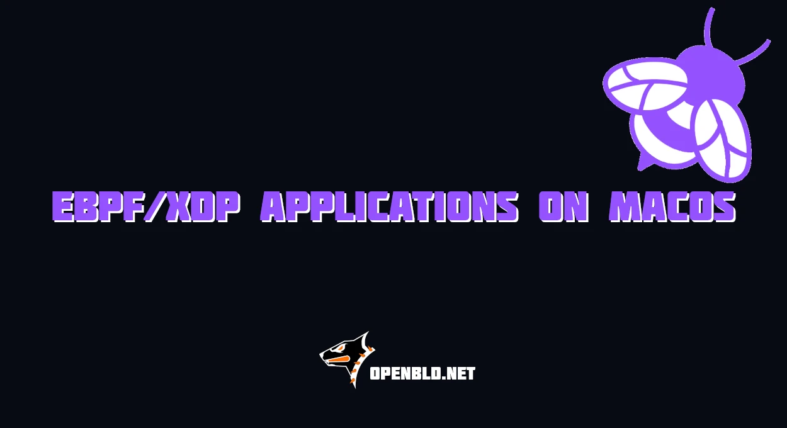

eBPF and XDP are increasingly used for network traffic filtering, observability, abuse protection, and performing extremely cheap packet inspections before traffic reaches the regular Linux networking stack.

There is one practical problem, though: if your primary workstation is a Mac — especially an Apple Silicon Mac — you cannot build and test Linux eBPF programs exactly the same way you build a normal Go application.

For a reproducible build environment, we need:

- Go
- Clang and LLVM
- Linux headers
- libbpf headers
- `bpf2go`
- Docker
- a Linux runtime provided by Colima
{/* truncate */}
In this guide, we will build a minimal XDP application using the following pipeline:

```text
macOS
  ↓
Colima
  ↓
Docker Linux/arm64
  ↓
clang -target bpf
  ↓
eBPF bytecode
  ↓
bpf2go
  ↓
Go application
  ↓
Linux/amd64 binary
  ↓
Linux kernel
  ↓
XDP
```

The XDP program itself will intentionally do nothing dangerous:

```c
return XDP_PASS;
```

It will see incoming packets and immediately allow them to continue through the normal Linux networking stack.

That makes it a good first test of the complete eBPF/XDP development lifecycle without introducing packet filtering into the experiment.

## How XDP Fits into the Linux Networking Path

XDP stands for **eXpress Data Path**.

It allows eBPF programs to execute very early in the packet receive path.

A simplified packet flow looks like this:

```text
NIC
 ↓
XDP / eBPF
 ↓
Linux networking stack
 ↓
nftables / routing
 ↓
socket
 ↓
application
```

An XDP program can return several actions, including:

- `XDP_PASS`
- `XDP_DROP`
- `XDP_TX`
- `XDP_REDIRECT`

For this guide, we will use only:

```c
XDP_PASS
```

So our program will not alter the machine's network behavior.

---

# Preparing macOS for Linux eBPF Builds

## Install Homebrew

If Homebrew is already installed, skip this section.

Install it using:

```bash
/bin/bash -c "$(curl -fsSL https://raw.githubusercontent.com/Homebrew/install/HEAD/install.sh)"
```

On Apple Silicon systems, Homebrew normally installs under:

```text
/opt/homebrew
```

Verify the installation:

```bash
brew --version
```

If macOS requires the Xcode Command Line Tools, install them with:

```bash
xcode-select --install
```

## Install Docker CLI and Colima

Docker Desktop is not required for this workflow.

Instead, we can use:

- Docker CLI
- Colima as the Linux VM and Docker runtime

Install both:

```bash
brew install docker colima
```

Start Colima:

```bash
colima start
```

Verify its status:

```bash
colima status
```

Then check Docker:

```bash
docker version
docker info
```

Run a simple container:

```bash
docker run --rm hello-world
```

If it starts successfully, Docker is ready.

---

# Understanding the Architectures Involved

On an Apple Silicon Mac:

```bash
uname -m
```

should normally return:

```text
arm64
```

During this guide, several different architectures will be involved:

```text
Host macOS        arm64
Docker builder    linux/arm64
Target server     linux/amd64
eBPF program      BPF instruction set
```

This is intentional.

The Linux container runs natively as ARM64 under Colima, while Go will later cross-compile the userspace program for an AMD64 Linux server.

The eBPF program itself is compiled for the BPF virtual instruction set rather than directly for either ARM64 or AMD64.

---

# Creating the Linux Build Environment

## Pull the Go Linux Image

We will use Go 1.25 on Debian Bookworm.

Pull the ARM64 image:

```bash
docker pull --platform linux/arm64 golang:1.25-bookworm
```

Inspect it:

```bash
docker image inspect golang:1.25-bookworm \
    --format '{{.Os}}/{{.Architecture}}'
```

Expected output:

```text
linux/arm64
```

Despite Docker running on macOS, the container itself is Linux.

## Create the Project Directory

Create a new project:

```bash
mkdir ebpf-xdp-demo
cd ebpf-xdp-demo
```

By the end of the guide, the project will look approximately like this:

```text
ebpf-xdp-demo/
├── Dockerfile
├── filter.c
├── gen.go
├── main.go
├── go.mod
└── go.sum
```

## Create the eBPF Builder Dockerfile

A standard Go container does not include everything required to compile eBPF code.

Create `Dockerfile`:

```dockerfile
FROM golang:1.25-bookworm

RUN apt-get update && \
    apt-get install -y --no-install-recommends \
        clang \
        llvm \
        libbpf-dev \
        linux-libc-dev \
        bpftool \
        make \
        dpkg-dev \
        file && \
    rm -rf /var/lib/apt/lists/*

RUN ln -s \
    /usr/include/$(dpkg-architecture -qDEB_HOST_MULTIARCH)/asm \
    /usr/include/asm

WORKDIR /src
```

Build the image:

```bash
docker build -t xdp-builder .
```

---

# Fixing Linux `asm` Headers Inside the Container

One of the more confusing errors when compiling eBPF programs on Debian-based systems is:

```text
fatal error: 'asm/types.h' file not found
```

An eBPF source file commonly includes:

```c
#include <linux/bpf.h>
```

Linux headers may then reference:

```c
#include <asm/types.h>
```

Debian uses a multiarch directory layout.

On ARM64, the headers may live under:

```text
/usr/include/aarch64-linux-gnu/asm/
```

On AMD64:

```text
/usr/include/x86_64-linux-gnu/asm/
```

Some Clang/eBPF compilation paths expect them under:

```text
/usr/include/asm/
```

That is why our Dockerfile creates this symlink:

```dockerfile
RUN ln -s \
    /usr/include/$(dpkg-architecture -qDEB_HOST_MULTIARCH)/asm \
    /usr/include/asm
```

Using `dpkg-architecture` keeps the Dockerfile architecture-independent.

---

# Verify the eBPF Build Toolchain

Before writing any code, verify that the container contains everything we need:

```bash
docker run --rm xdp-builder bash -c '
    echo "=== Architecture ==="
    uname -m

    echo
    echo "=== Go ==="
    go version

    echo
    echo "=== Clang ==="
    clang --version | head -1

    echo
    echo "=== LLVM ==="
    llvm-config --version

    echo
    echo "=== Linux asm headers ==="
    ls -l /usr/include/asm/types.h

    echo
    echo "=== bpftool ==="
    bpftool version
'
```

My output looks like this:

```text
=== Architecture ===
aarch64

=== Go ===
go version go1.25.14 linux/arm64

=== Clang ===
Debian clang version 14.0.6

=== LLVM ===
14.0.6

=== Linux asm headers ===
-rw-r--r-- 1 root root 31 Aug  3 18:40 /usr/include/asm/types.h

=== bpftool ===
bpftool v7.1.0
using libbpf v1.1
features: libbpf_strict
```

This confirms:

- Linux architecture
- Go installation
- Clang
- LLVM
- Linux `asm` headers
- `bpftool`

At this point, the build environment is ready.

---

# Write the Minimal XDP Program

Create `filter.c`:

```c
//go:build ignore

#include <linux/bpf.h>
#include <bpf/bpf_helpers.h>

SEC("xdp")
int xdp_pass_all(struct xdp_md *ctx)
{
    return XDP_PASS;
}

char __license[] SEC("license") = "Dual MIT/GPL";
```

The program contains only one XDP function:

```c
SEC("xdp")
int xdp_pass_all(struct xdp_md *ctx)
```

and always returns:

```c
XDP_PASS
```

Its behavior is therefore:

```text
packet
   ↓
XDP program
   ↓
XDP_PASS
   ↓
normal Linux networking
```

No packets are dropped, redirected, or modified.

The:

```c
//go:build ignore
```

line prevents the regular Go build process from treating the C file as a normal package source file.

---

# Generate Go Bindings with `bpf2go`

Create `gen.go`:

```go
package main

//go:generate go tool bpf2go -tags linux bpf filter.c
```

`bpf2go` connects our C eBPF program to the Go application.

The process is roughly:

```text
filter.c
   ↓
clang
   ↓
eBPF ELF object
   ↓
bpf2go
   ↓
generated Go bindings
   ↓
embedded BPF bytecode
```

This means the final Go binary can carry the BPF program with it.

---

# Initialize the Go Module

Initialize the module using the container:

```bash
docker run --rm \
    -v "$PWD:/src" \
    -w /src \
    xdp-builder \
    go mod init ebpf-xdp-demo
```

Add `cilium/ebpf`:

```bash
docker run --rm \
    -v "$PWD:/src" \
    -w /src \
    xdp-builder \
    go get github.com/cilium/ebpf
```

Add `bpf2go` as a Go tool dependency:

```bash
docker run --rm \
    -v "$PWD:/src" \
    -w /src \
    xdp-builder \
    go get -tool github.com/cilium/ebpf/cmd/bpf2go
```

Then:

```bash
docker run --rm \
    -v "$PWD:/src" \
    -w /src \
    xdp-builder \
    go mod tidy
```

Check the module:

```bash
cat go.mod
```

Go now tracks the required `cilium/ebpf` dependency and the `bpf2go` tool version.

---

# Why eBPF Architecture Is Different from `GOARCH`

Our build container runs as:

```text
linux/arm64
```

Later, we will build the Go executable for:

```text
linux/amd64
```

But the eBPF C program is compiled for neither architecture.

Instead:

```text
C
 ↓
clang -target bpf
 ↓
BPF instruction set
```

Conceptually:

```text
                   ┌── eBPF bytecode ──→ BPF VM / JIT
filter.c ── clang ─┤
                   │
main.go ─── Go ────┴── amd64 ELF ─────→ Linux CPU
```

Therefore:

```bash
GOARCH=amd64
```

controls the userspace Go executable.

It does **not** control the architecture of the embedded eBPF program.

---

# Write the Go XDP Loader

Now we can write a minimal Go agent that loads the generated eBPF object and attaches it to a network interface.

Create `main.go`:

```go
//go:build linux

package main

import (
    "fmt"
    "log"
    "net"
    "os"

    "github.com/cilium/ebpf/link"
    "github.com/cilium/ebpf/rlimit"
)

func main() {
    if len(os.Args) != 2 {
        fmt.Fprintf(
            os.Stderr,
            "usage: %s <interface>\n",
            os.Args[0],
        )
        os.Exit(1)
    }

    ifaceName := os.Args[1]

    iface, err := net.InterfaceByName(ifaceName)
    if err != nil {
        log.Fatalf(
            "lookup interface %q: %v",
            ifaceName,
            err,
        )
    }

    if err := rlimit.RemoveMemlock(); err != nil {
        log.Fatalf(
            "remove memlock limit: %v",
            err,
        )
    }

    var objs bpfObjects

    if err := loadBpfObjects(&objs, nil); err != nil {
        log.Fatalf(
            "load BPF objects: %v",
            err,
        )
    }

    defer objs.Close()

    lnk, err := link.AttachXDP(link.XDPOptions{
        Program:   objs.XdpPassAll,
        Interface: iface.Index,
    })
    if err != nil {
        log.Fatalf(
            "attach XDP to %s: %v",
            ifaceName,
            err,
        )
    }

    defer lnk.Close()

    log.Printf(
        "XDP_PASS program attached to %s",
        ifaceName,
    )

    log.Println("Press Enter to detach...")

    _, _ = fmt.Scanln()
}
```

The program performs five basic operations:

1. Resolves the network interface.
2. Adjusts the memory lock limit required by BPF on systems where this is still necessary.
3. Loads the generated BPF objects.
4. Attaches the XDP program.
5. Keeps the link alive until the process exits.

When the program terminates:

```go
defer lnk.Close()
```

detaches the XDP link.

---

# Build and Inspect the eBPF Program

Now we can perform generation, inspection, and Go cross-compilation in one container invocation.

```bash
docker run --rm \
    -v "$PWD:/src" \
    -w /src \
    xdp-builder \
    bash -c '
        set -e

        echo "=== 1. GENERATING eBPF BYTECODE ==="
        go generate ./...

        echo
        echo "=== 2. VERIFYING eBPF ELF OBJECT ==="
        file bpf_bpfel.o

        echo
        echo "=== 3. DISASSEMBLING eBPF PROGRAM ==="
        llvm-objdump -d bpf_bpfel.o

        echo
        echo "=== 4. BUILDING LINUX/AMD64 GO BINARY ==="
        CGO_ENABLED=0 \
        GOOS=linux \
        GOARCH=amd64 \
        go build -o xdp-demo .

        echo
        echo "=== 5. VERIFYING FINAL BINARY ==="
        file xdp-demo

        echo
        echo "Build completed successfully."
    '
```

I would strongly keep:

```bash
set -e
```

My output looks like this:

```text
=== 1. GENERATING eBPF BYTECODE ===
go: downloading github.com/cilium/ebpf v0.22.0
go: downloading golang.org/x/sys v0.43.0

=== 2. VERIFYING eBPF ELF OBJECT ===
bpf_bpfel.o: ELF 64-bit LSB relocatable, eBPF, version 1 (SYSV), not stripped

=== 3. DISASSEMBLING eBPF PROGRAM ===

bpf_bpfel.o:    file format elf64-bpf

Disassembly of section xdp:

0000000000000000 <xdp_pass_all>:
       0:       b7 00 00 00 02 00 00 00 r0 = 2
       1:       95 00 00 00 00 00 00 00 exit

=== 4. BUILDING LINUX/AMD64 GO BINARY ===

=== 5. VERIFYING FINAL BINARY ===
xdp-demo: ELF 64-bit LSB executable, x86-64, version 1 (SYSV), statically linked, BuildID[sha1]=d36146e9be1af1f7ebb40da72e6e5af05eb5c340, with debug_info, not stripped

Build completed successfully.
```

Without it, a failed intermediate command may not stop the shell in the way you expect when this build sequence evolves later.

---

# Understanding the Smoke Test

The first interesting artifact is:

```text
bpf_bpfel.o
```

Run:

```bash
file bpf_bpfel.o
```

The output should resemble:

```text
ELF 64-bit LSB relocatable, eBPF, version 1 (SYSV)
```

This confirms that Clang generated an actual eBPF ELF object rather than a normal ARM64 or AMD64 object.

Next:

```bash
bpftool prog dump obj bpf_bpfel.o
```

should show a very small program.

Conceptually:

```text
0: r0 = 2
1: exit
```

Why `2`?

Because the XDP action constants include:

```text
XDP_ABORTED   = 0
XDP_DROP      = 1
XDP_PASS      = 2
XDP_TX        = 3
XDP_REDIRECT  = 4
```

Our C statement:

```c
return XDP_PASS;
```

therefore becomes approximately:

```text
r0 = 2
exit
```

This is a useful smoke test because we can inspect the actual BPF instructions before deploying anything to a server.

---

# Cross-Compile the Go Agent for Linux AMD64

The final build uses:

```bash
CGO_ENABLED=0 \
GOOS=linux \
GOARCH=amd64 \
go build -o xdp-demo .
```

Our environment therefore performs this transition:

```text
macOS arm64
      ↓
Docker linux/arm64
      ↓
Go cross-compiler
      ↓
Linux amd64 executable
```

Verify the result:

```bash
file xdp-demo
```

Expected output should contain something similar to:

```text
ELF 64-bit LSB executable, x86-64
```

## Why Disable CGO?

Setting:

```bash
CGO_ENABLED=0
```

makes cross-compilation straightforward.

If the userspace application required CGO, building an AMD64 Linux executable from an ARM64 build container would also require an appropriate C cross-compiler and toolchain.

For a pure Go userspace loader, this complexity is unnecessary.

---

# Deploy the XDP Agent to Linux

Copy the binary to the target server:

```bash
scp xdp-demo root@server:/usr/local/sbin/
```

On Linux:

```bash
chmod +x /usr/local/sbin/xdp-demo
```

Verify it:

```bash
file /usr/local/sbin/xdp-demo
```

---

# Verify Kernel eBPF and XDP Support

Check the running kernel:

```bash
uname -r
```

Then inspect BPF support:

```bash
bpftool feature probe kernel
```

For a shorter view:

```bash
bpftool feature probe kernel | grep -E 'BPF|XDP'
```

You can also inspect the kernel configuration:

```bash
grep -E \
    'CONFIG_(BPF|BPF_SYSCALL|BPF_JIT|XDP)' \
    /boot/config-$(uname -r)
```

Typical BPF-enabled kernels include at least:

```text
CONFIG_BPF=y
CONFIG_BPF_SYSCALL=y
```

The exact feature set depends on the kernel and distribution.

---

# Attach the XDP Program

Find the target network interface:

```bash
ip -br link
```

For example:

```text
eth0
```

Run the program:

```bash
sudo /usr/local/sbin/xdp-demo eth0
```

You should see:

```text
XDP_PASS program attached to eth0
Press Enter to detach...
```

My output:

```bash
sudo /usr/local/sbin/xdp-demo eth0                                                                                                                                             8 ms
2026/08/26 14:23:38 XDP_PASS program attached to eth0
2026/08/26 14:23:38 Press Enter to detach...
```

The network should continue operating normally because the program always returns:

```c
XDP_PASS
```

---

# Verify the Program Inside the Kernel

Open another terminal or SSH session.

List loaded BPF programs:

```bash
bpftool prog list
```

You should see a small program with a name similar to:

```text
2525: xdp  name xdp_pass_all  tag 3b185187f1855c4c  gpl
	loaded_at 2026-08-26T14:23:38+0500  uid 0
	xlated 16B  jited 22B  memlock 4096B
	btf_id 419
```

Inspect network attachments:

```bash
bpftool net
```

Inspect the interface:

```bash
ip -details link show dev eth0
```

You should see an XDP program attached to the interface.

Once you know its program ID, inspect it directly:

```bash
bpftool prog show id <ID>
```

At this point, we have verified the complete chain:

```text
C source
  ↓
Clang
  ↓
eBPF ELF
  ↓
bpf2go
  ↓
Go binary
  ↓
BPF verifier
  ↓
Linux kernel
  ↓
XDP attachment
```

---

# Verify That Network Traffic Still Works

While the XDP program is attached, test basic connectivity:

```bash
ping 1.1.1.1
```

If the machine provides DNS:

```bash
dig example.com
```

You can also test whatever service normally runs through the selected interface.

Because the XDP program returns `XDP_PASS`, packets should continue through the networking stack unchanged.

---

# Detach the XDP Program Safely

Our Go program waits for Enter.

When Enter is pressed, the process exits and:

```go
defer lnk.Close()
```

removes the XDP attachment.

Verify:

```bash
bpftool net
```

and:

```bash
ip -details link show dev eth0
```

The program should no longer be attached.

---

# Emergency XDP Detach

Before experimenting with XDP on a remote server, it is worth knowing how to detach a program independently of the userspace agent.

A common command is:

```bash
ip link set dev eth0 xdp off
```

For generic XDP:

```bash
ip link set dev eth0 xdpgeneric off
```

Then verify:

```bash
ip -details link show dev eth0
```

This matters because a logically incorrect but verifier-valid program could contain:

```c
return XDP_DROP;
```

and drop every packet reaching the interface.

If you are performing experiments over SSH, console or out-of-band access is always preferable when testing packet-drop logic for the first time.

---

# Generic, Native, and Offloaded XDP

XDP can operate in several modes.

## Generic XDP

Often referred to as:

```text
xdpgeneric
```

or:

```text
SKB mode
```

It does not require native XDP support from the network driver.

It is useful for:

- development
- testing
- virtual machines
- environments where driver-mode XDP is unavailable

## Native XDP

Often called:

```text
xdpdrv
```

The program runs directly in the driver's receive path.

This normally provides significantly better packet-processing performance than generic mode.

## Hardware-Offloaded XDP

Some network adapters can execute supported BPF programs directly on the NIC.

This requires compatible hardware and drivers and is outside the scope of this guide.

---

# Why XDP Is Particularly Interesting for DNS

A conventional DNS path may look like:

```text
Internet
   ↓
NIC
   ↓
Linux networking stack
   ↓
UDP/TCP :53
   ↓
DNS daemon
```

With XDP:

```text
Internet
   ↓
NIC
   ↓
XDP/eBPF
   ↓
Linux networking stack
   ↓
UDP/TCP :53
   ↓
DNS daemon
```

This creates an opportunity to perform very inexpensive operations before traffic reaches sockets or the DNS application itself.

Potential examples include:

- packet counters
- basic protocol validation
- simple allowlists
- rate limiting
- detection of obvious abuse patterns
- dropping clearly unwanted traffic
- telemetry exported through BPF maps

The important distinction is that XDP is most useful for **cheap packet-level decisions**.

Complex DNS policy and application logic usually still belongs in userspace.

---

# The eBPF Verifier Does Not Validate Your Business Logic

The Linux kernel does not blindly execute arbitrary BPF programs.

A simplified load sequence looks like this:

```text
userspace
   ↓
BPF_PROG_LOAD
   ↓
eBPF verifier
   ↓
accepted program
   ↓
JIT / interpreter
   ↓
execution
```

The verifier checks whether the program can execute safely according to BPF rules.

But it does not understand what your application *intended* to do.

For example:

```c
SEC("xdp")
int drop_everything(struct xdp_md *ctx)
{
    return XDP_DROP;
}
```

may be a perfectly valid eBPF program.

It simply happens to be operationally disastrous on the wrong interface.

That distinction is important:

> The verifier protects the kernel from unsafe BPF execution. It does not protect your network from incorrect filtering logic.

---

# A Safer SRE Workflow for XDP Filters

For production packet filtering, an incremental rollout is much safer than immediately deploying `XDP_DROP`.

A useful progression is:

```text
Observe
   ↓
Count
   ↓
Would Drop
   ↓
Enforce
```

## Stage 1 — Observe

Start by always passing packets:

```c
return XDP_PASS;
```

Verify:

- program loading
- attachment
- counters
- CPU behavior
- traffic behavior

## Stage 2 — Count

Detect suspicious traffic, but do not drop it:

```c
if (suspicious) {
    increment_counter();
}

return XDP_PASS;
```

## Stage 3 — Would Drop

Maintain telemetry that indicates which packets would have been dropped.

The traffic still passes.

This is where false positives should be investigated.

## Stage 4 — Enforce

Only after validating the observed traffic should the final action become:

```c
return XDP_DROP;
```

This approach is especially useful for DNS, where legitimate traffic patterns can vary considerably depending on NAT, resolvers, clients, and upstream infrastructure.

---

# What We Built

We now have a reproducible eBPF/XDP development pipeline that starts on macOS and ends with an actual XDP program attached to Linux:

```text
macOS ARM64
      ↓
Homebrew
      ↓
Docker CLI
      ↓
Colima
      ↓
Linux ARM64 builder
      ↓
Clang / LLVM
      ↓
filter.c
      ↓
bpf2go
      ↓
eBPF ELF
      ↓
generated Go bindings
      ↓
Go cross-build
      ↓
Linux AMD64 executable
      ↓
BPF verifier
      ↓
XDP attach
      ↓
network traffic
```

The eBPF side intentionally contains almost no logic:

```c
SEC("xdp")
int xdp_pass_all(struct xdp_md *ctx)
{
    return XDP_PASS;
}
```

That simplicity is useful.

It allows us to validate:

- Docker and Colima
- Linux headers
- Clang BPF compilation
- `bpf2go`
- Go cross-compilation
- ELF architecture
- BPF bytecode
- the Linux BPF verifier
- XDP attachment
- clean detach behavior

without introducing packet-filtering complexity.

From here, the same foundation can be extended with:

- Ethernet parsing
- IPv4 and IPv6 parsing
- UDP and TCP parsing
- DNS header inspection
- BPF maps
- packet counters
- allowlists
- temporary blocks
- token-bucket rate limiting
- userspace configuration
- telemetry

At that point, the minimal XDP example becomes the foundation for a real network protection agent.

---

# Quick Reference

## Install the Environment

```bash
brew install docker colima

colima start

docker run --rm hello-world
```

## Build the Builder Image

```bash
docker build -t xdp-builder .
```

## Verify the Toolchain

```bash
docker run --rm xdp-builder bash -c '
    uname -m
    go version
    clang --version | head -1
    llvm-config --version
    bpftool version
    ls -l /usr/include/asm/types.h
'
```

## Build and Inspect

```bash
docker run --rm \
    -v "$PWD:/src" \
    -w /src \
    xdp-builder \
    bash -c '
        set -e

        go generate ./...

        file bpf_bpfel.o

        bpftool prog dump obj bpf_bpfel.o

        CGO_ENABLED=0 \
        GOOS=linux \
        GOARCH=amd64 \
        go build -o xdp-demo .

        file xdp-demo
    '
```

## Run on Linux

```bash
sudo ./xdp-demo eth0
```

## Inspect the Attachment

```bash
bpftool prog list

bpftool net

ip -details link show dev eth0
```

## Emergency Detach

```bash
ip link set dev eth0 xdp off
```

For generic XDP:

```bash
ip link set dev eth0 xdpgeneric off
```

## GitHub Source Code

On GitHub, you can find the complete source code for this guide at:

- https://github.com/m0zgen/ebpf-xdp-demo

#### Follow OpenBLD

- Official [Telegram](https://t.me/openbld)
