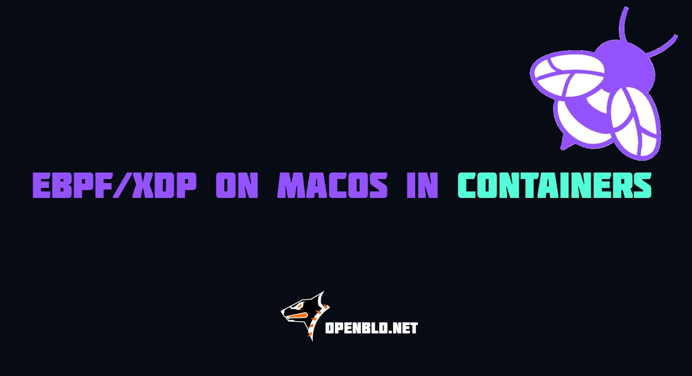

Reproduction of [eBPF/XDP Applications on macOS with Colima, Docker](2026-08-27-build-xdp-ebpf-macos-guide.md) blogpost,
with Apple's native `container` CLI in place of Colima + Docker, plus a custom kernel
that restores the features Apple's stock VM kernel leaves out.

Host: Apple M4, macOS 27.0 (build 26A5406e), `container` 1.3.0, kernel 6.18.15 aarch64.
{/* truncate */}
## Verdict

**1:1 parity with the blog, and then some.** Build, load, attach and detach all
happen inside Apple `container`. Everything is aarch64 — `[build] rosetta` is set
to `false` in `~/.config/container/config.toml`, so Rosetta is not merely unused,
it is unavailable to the builder VM.

With the custom kernel in `kernel/` the environment additionally supports the
things the blog never gets to: CO-RE, kprobes/tracepoints/fentry, BPF LSM,
AF_XDP and the JIT.

## Two kernels

| | stock (`vmlinux-6.18.15-186`) | custom (`kernel/vmlinux-ebpf-6.18.15`) |
|---|---|---|
| XDP generic on `eth0` | yes | yes |
| XDP native + `bpf_link` on `veth` | yes | yes |
| XDP native on `eth0` | **no** (see below) | **no** (host-side, not fixable in the guest) |
| tc/cgroup/socket/sk_msg progs | yes | yes |
| kprobe / tracepoint / fentry / LSM | no | **yes** |
| BTF (`/sys/kernel/btf/vmlinux`) → CO-RE | no | **yes** (4.5 MB, 110k-line `vmlinux.h`) |
| AF_XDP (`xskmap`, `XDP_SOCKETS`) | no | **yes** (native mode on veth) |
| JIT | no (`xlated 16B not jited`) | **yes** (`xlated 16B jited 56B`) |
| tracefs / `bpf_printk` | no | **yes** |

Native XDP on `eth0` is impossible in both: Apple's vmnet virtio-net advertises
`rx-gro-hw: on [fixed]`, so the driver refuses with *"Can't set XDP while host is
implementing GRO_HW/CSUM"*. `bpf_link` XDP attach also fails on that device. Use
`xdpgeneric` on `eth0`, or a `veth` pair for native-mode work — `src/main.go`
falls back automatically (bpf_link → netlink native → netlink generic).

## Layout

```
Containerfile arm64 builder/runner image (clang, llvm, libbpf, bpftool, Go 1.25)
src/ the blog's XDP program + Go loader (bpf2go)
tracing/ CO-RE kprobe on do_execveat_common -> ring buffer
afxdp/ libxdp UMEM + xsk_socket__create bound to veth0
kernel/build-kernel.sh builds the eBPF-enabled arm64 kernel inside a container
```

## Usage

```sh
make image # arm64 builder image
make build # clang -target bpf + bpf2go + go build
make demo # XDP attach on veth0 (run `make build` first; stock kernel is enough)
make kernel # build kernel/vmlinux-ebpf-6.18.15 (~5 min on M4, 8 cores)
make tracing # CO-RE kprobe demo (requires custom kernel)
make afxdp # AF_XDP socket demo (requires custom kernel)
make probe # capability dump; KERNEL=... to compare kernels
```

`KERNEL=kernel/vmlinux-ebpf-6.18.15` is passed via `container run -k`, per
container — the system default kernel is left untouched. To make it the default:
`container system kernel set --arch arm64 --binary $PWD/kernel/vmlinux-ebpf-6.18.15 --force`
(verified flag syntax; `--recommended` restores Apple's default). To exercise a
target against the *stock* kernel instead, pass a non-existent path:
`make probe KERNEL=none`.

`--cap-add ALL` is required; each container is root in its own micro-VM, so
there is no privileged flag and none is needed.

## Kernel build notes

* Base config is the running kernel's own `/proc/config.gz`, so the build only
  adds features. Enabled: `DEBUG_INFO_BTF` (+DWARF5), `KPROBES`, `KPROBE_EVENTS`,
  `UPROBES`, `FTRACE`, `BPF_EVENTS`, `FPROBE`, `BPF_JIT` (+default-on), `BPF_LSM`,
  `XDP_SOCKETS` (+diag), `NET_CLS_BPF`, `NET_ACT_BPF`, `DEBUG_FS`.
* The build runs in a `container volume` (`kernelbuild`), **not** on a virtiofs
  mount of the host: macOS APFS is case-insensitive and the Linux source has
  case-colliding filenames, so extracting onto the host fails with
  `Permission denied`. Only `arch/arm64/boot/Image` is copied back.
* `scripts/config --enable` takes one symbol per invocation; passing a list
  silently prints usage and (under `set -e`) kills the build.
* Output must be `arch/arm64/boot/Image` (raw ARM64 boot Image) — that is the
  format `container` expects, matching Apple's own kernel file.

## Differences from the blogpost

* Colima + Docker → `container build` / `container run`; each container is its
  own lightweight VM.
* The blog cross-compiles the loader to `linux/amd64` as a deploy artifact that
  cannot run on the host. Here the loader is built `arm64` and actually executed
  and attached locally; `GOARCH=amd64 go build` still produces the deploy binary.
* `bpf2go -type event` needs the struct referenced from a dummy global
  (`const struct event *unused_event`), otherwise clang drops it from BTF.

## Host config changes made

* `~/.config/container/config.toml`: removed a stale `[kernel]` block pointing at
  a Kata tarball — `container` 1.3.0 rejects it with
  `kernel.digest is required when kernel.url is not the default URL` and refuses
  to start. Set `[build] rosetta = false`. Backups: `config.toml.bak.*`.

## Reference

- Reproduction of [eBPF/XDP Applications on macOS with Colima, Docker](2026-08-27-build-xdp-ebpf-macos-guide.md)

#### Follow OpenBLD

- Official [Telegram](https://t.me/openbld)
