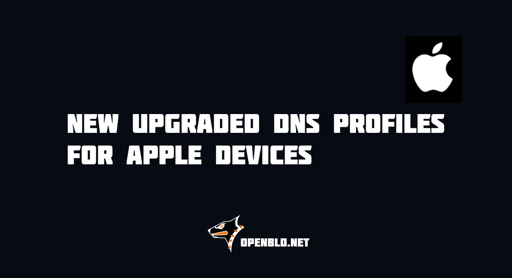

# OpenBLD Updated DNS DoH/DoT Apple Profiles

New ADA and RIC Apple configuration profiles have been released, version `15.3`, improving DNS-over-HTTPS (DoH) and DNS-over-TLS (DoT) support for iOS, iPadOS, and macOS devices.
{/* truncate */}
## How to install Apple DNS profiles

Profiles tested and compatible with latest iOS, iPadOS, and macOS releases (tested on macOS Tahoe 26.5.2 and iOS 26.6.1).

Follow instructions in the [Apple Devices Setup Guide](/docs/get-started/setup-mobile-devices/apple/) to install the new profiles.

#### Updates

- Official [Telegram](https://t.me/openbld)
