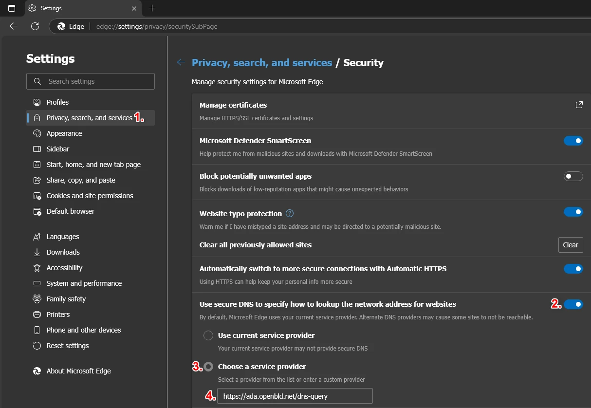

# Microsoft Edge

Setup OpenBLD.net on Microsoft Edge

1. Go to `edge://settings/privacy`
2. Scroll down to the Security section
3. Make sure the Use secure DNS option is enabled
4. Select Choose a service provider
5. Set address:

```shell
https://ada.openbld.net/dns-query
```

Example:




[//]: # ()
