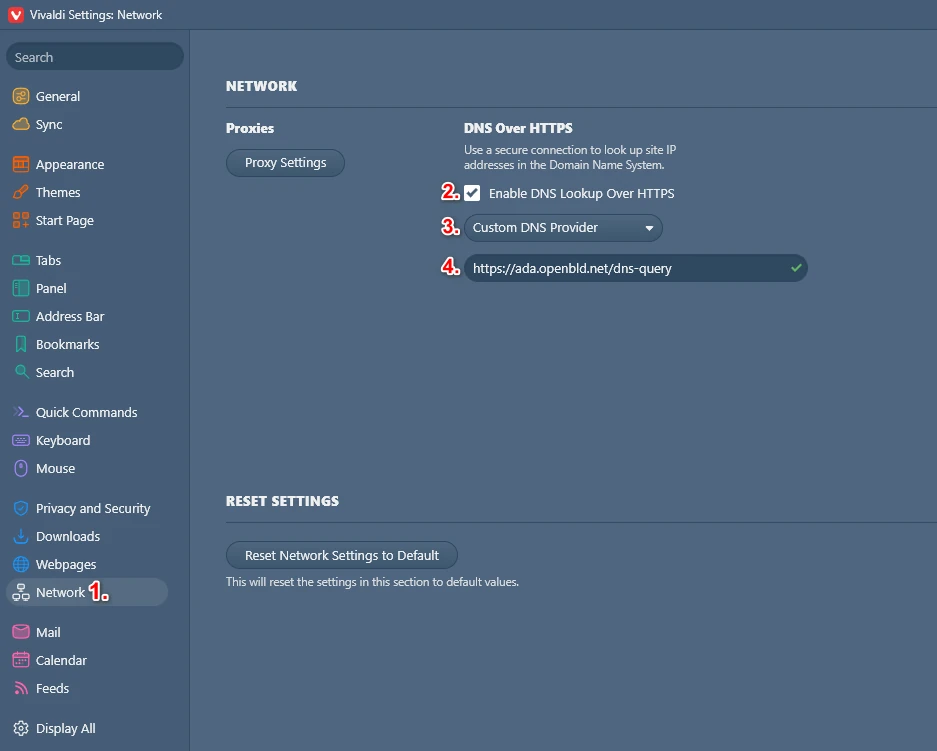
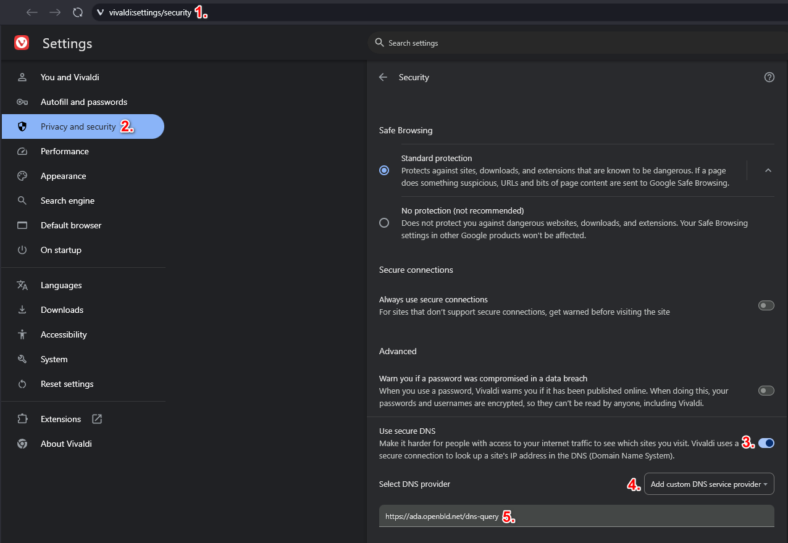

# Vivaldi Browser

To block ads and tracking in the Vivaldi browser, you need to configure a secure DNS server through `Network` settings:

1. Open Vivaldi browser > Settings > Network
2. In the DNS over HTTPS section, enable the **Enable DNS Lookup Over HTTPS** option
3. Select the **Use Custom DNS** option
4. In the **Custom DNS URL** field, enter the following address:

```shell
https://ada.openbld.net/dns-query
```

Example:



## Method 2: Setup OpenBLD.net on Vivaldi Browser

1. Type in address bar `chrome://settings/security` (this automatically redirect to `vivaldi://settings/security`)
2. Select the Privacy and Security tab
3. Scroll down and enable **Use secure DNS** server option
4. Select from the dropdown menu "Select custom DNS service provider"
5. Set address:

```shell
https://ada.openbld.net/dns-query
```

## Example


Just copy and paste this link to your browser settings:

```shell
https://ada.openbld.net/dns-query
```

## OpenBLD.net Extension for Vivaldi Browser

As an additional option, you can use a browser extension:

* Setup [OpenBLD.net Blocker](/docs/get-started/setup-browsers/extensions/) extension.


