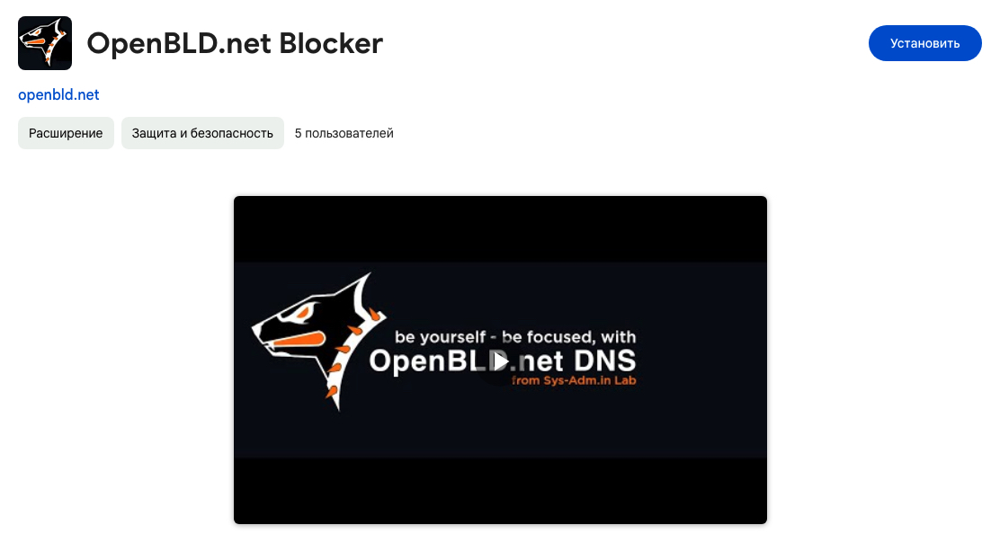

# Extensions

Using a browser extension as an additional OpenBLD.net option.

At the current time extension is available for Google Chrome and Brave browsers.

Extension named as [OpenBLD.net Blocker](https://chromewebstore.google.com/detail/openbldnet-blocker/jjpjcmckhkcefefgbgghomdhcbfmklea), 
and it is available in Chrome web [store](https://chrome.google.com/webstore/detail/openbldnet-blocker/jjpjcmckhkcefefgbgghomdhcbfmklea) 
this extension compatible with any Chrome-based browsers.

## Installation

## How to Install

* Open OpenBLD.net Blocker extension page from Google Chrome [Store](https://chrome.google.com/webstore/detail/openbldnet-blocker/jjpjcmckhkcefefgbgghomdhcbfmklea)
* Install it

After installation, you can see the OpenBLD.net Blocker icon in your browser toolbar, or you can open it from the browser extension `chrome://extensions/` section 
in the browser.

* Done ✅
