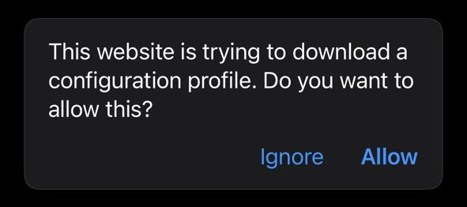
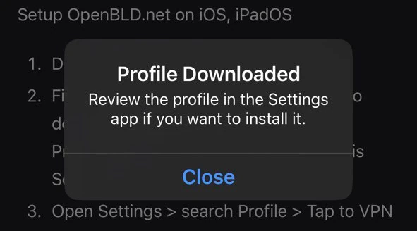
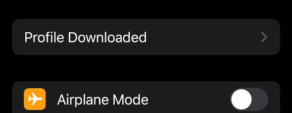
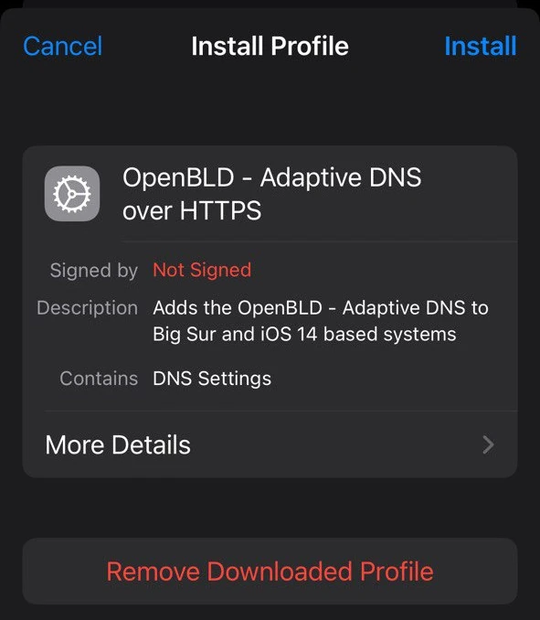
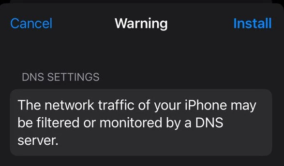

# Apple Devices

To block ads and tracking on Apple devices, you need to install a DNS profile.

Setup OpenBLD.net on iOS, iPadOS

1. Open `Safari` and **Allow** download ADA iOS/macOS [profile](pathname:///profiles/OpenBLD-DoH-v15-3.mobileconfig):

:::note

In some ceases profile can be opened as **plain text** file in `xml` format:

:::

Example:

Don't worry, just **download** it:

- Press on the profile download link
- Hold your finger on the screen to display the context menu
- Select **Download**:

and then **open** from _Files_ app or _Downloads_ folder.

2. After profile was downloaded you'll see a message: 
_**Profile Downloaded. Review the profile in the Settings app if you want to install it**_:

3. Open Settings > search new **Profile Downloaded** settings item

4. **Install** profile:

5. **Install** DNS Settings:

6. Done

:::tip
### RIC Profile
If you want to use RIC, you need to download [profile](pathname:///profiles/OpenBLD-RIC-DoH-v15-3.mobileconfig) and install it in the same way as the ADA profile.
:::

## Experiments

DoH, DoT profiles for ADA with new Apple mobile config formats:

- OpenBLD ADA DoH profile - Download [OpenBLD-DoH-v15-3](pathname:///profiles/OpenBLD-DoH-v15-3.mobileconfig)
- OpenBLD KID DoT profile - Download [OpenBLD-KID-DoT-v15-3](pathname:///profiles/OpenBLD-KID-DoT-v15-3.mobileconfig)
