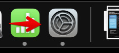
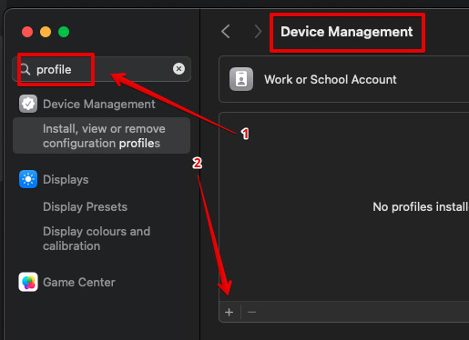
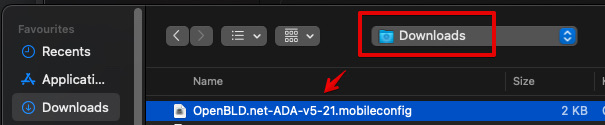
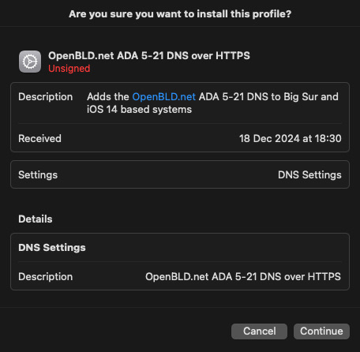

# MacOS

Setup OpenBLD.net in macOS

1. Open Safari
2. Download the profile from the [Apple devices settings](/docs/get-started/setup-mobile-devices/apple)
3. Install the profile similar to [iOS setup](/docs/get-started/setup-mobile-devices/apple)

## Step by Step

After downloading the profile, you can install it by following these steps:

1. Open System Preferences

2. Find the Profiles section and press the Add button `+`

3. Select the downloaded profile and press the Open button

4. Press the **Continue** button

5. Press the **Install** button in the opened window
6. Done! You have successfully installed the OpenBLD.net profile
