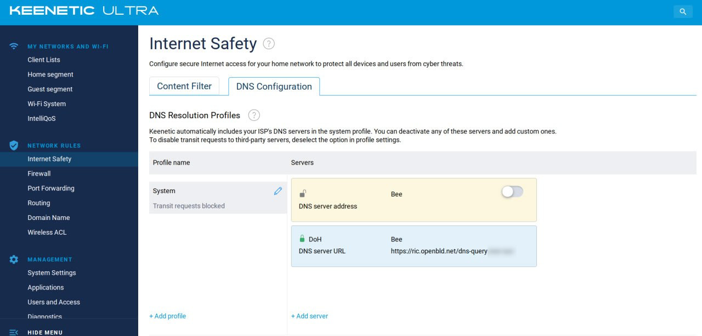
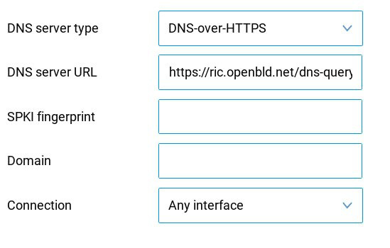
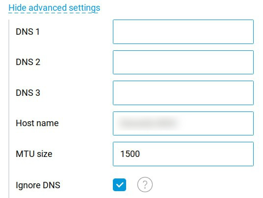

# Network Devices

If your router support DoH/DoT, you can use OpenBLD.net as `https` with `dns-query` link:

```shell
https://ada.openbld.net/dns-query
```

Or as `tls`:

```shell
ada.openbld.net
```

## Additional Instructions

### Keenetic

Use ADA or RIC as DoH/DoT DNS provider on your Keenetic router:



Example for DoH:



Don't forget to check the "Ignore DNS" option in additional settings window:



* Official manual, how to [setup](https://support.keenetic.ru/eaeu/ultra/kn-1811/en/31543-dot-and-doh-proxy-servers-for-dns-requests-encryption.html) Keenetic for DoT and DoH encryption.

### Mikrotik

:::warning

OpenBLD.net uses **HTTP/2** protocol. Mikrotik does not support HTTP/2 and can not be used such as DoH client.

:::

* How [setup](https://jcutrer.com/howto/networking/mikrotik/mikrotik-dns-over-https) on Mikrotik
    * In this article on step 2 specified broken link, possible fix:
    * `/tool fetch url=https://curl.se/ca/cacert.pem`
    * `/certificate import file-name=cacert.pem passphrase="your password"`

