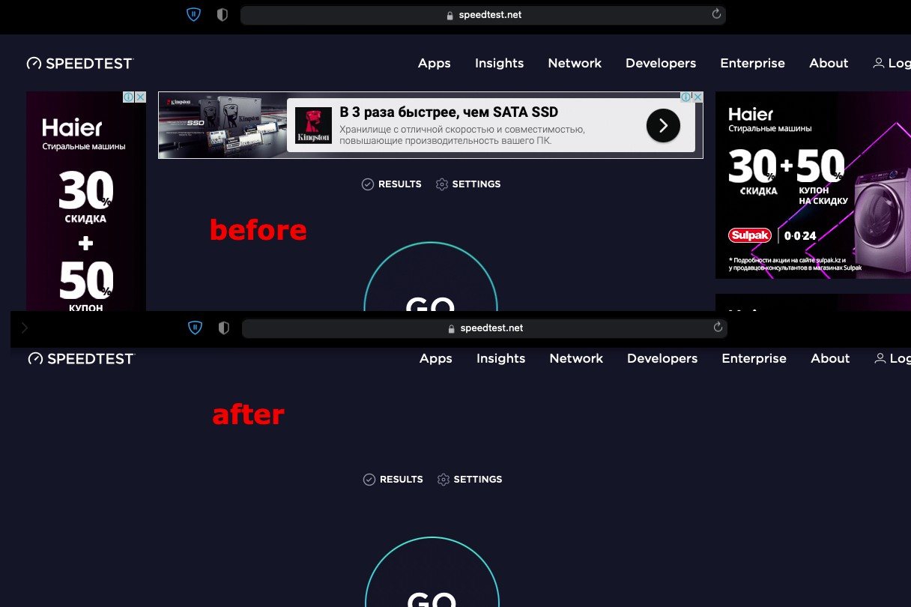

# How it Works

OpenBLD.net DNS is a multi-compatible, simple, fast service with in different locations of the world. OpenBLD DNS it is a open DNS service.
- **Easily** - Simple using without software installations. OpenBLD.net works in several modes - Adaptive (ADA), Strict (RIC), [OpenBLD+](4.openbld-plus.md).
- **Multi-compatible** - Enough to configure the private settings of the browser, mobile device (Android 9+, iOS 14+ are supported) or configure OpenBLD DNS on a home or office router and feel the "OpenBLD effect" 🌱

# Operating Modes

- **Adaptive (ADA)** - Recommended for most users
- **Strict (RIC)** - Recommended for advanced users
- **OpenBLD+ (BLD+)** - Personal or Enterprise support. [Get more details](4.openbld-plus.md).

:::tip
**[OpenBLD Plus](4.openbld-plus.md)** - This includes personal support, no limits on redundant requests, analysis of security or technical incidents. It is provided based on monthly donations in the amount of $15+ or similar in any other currency. 
See details [here](4.openbld-plus.md).
:::

### ADA vs RIC

The key difference between ADA and RIC in OpenBLD.net DNS is that ADA allows various services such as Yandex, TikTok, Facebook, etc. By "various services," we mean services for managing marketing cabinets or business tools.

#### What Does ADA Allow?

- Social media tools (e.g., Facebook, Twitter, LinkedIn, TikTok, etc.)
- All Yandex tools (Alice, Kinopoisk, etc.)
- All Google tools
- Advertising links from search results
- Etc.

OpenBLD.net uses a granular approach. If ADA allows, for example, all Yandex resources, 
then RIC allows key services (for example: mail, passport, money, etc.). In simple terms, RIC is a more "strict" service that **_can affect_** some Internet services.

ADA is an OpenBLD.net "add-on," adapted and suitable for most users of the OpenBLD.net DNS service.

## Locations

- Europe (Netherlands, Germany, Latvia, Bulgaria)
- Asia (Kazakhstan)
- Japan (Tokyo)

:::tip
Some servers, rarely, but may change IP addresses. 
All changes are usually reported in the official Telegram channel of the project cee [Contact](/docs/contacts.md) for more details.
:::

## Connectives

OpenBLD.net supports IPv4 and IPv6 (testing) and can be used in different ways:

- DoH - `https://ada.openbld.net/dns-query` or `https://ric.openbld.net/dns-query`
- DoT - `ada.openbld.net` or `ric.openbld.net`
- **IPv4** and **IPv6** - `Under Maintenance` if you really need IP addresses, please contact us through [Contacts](/docs/contacts.md) page.

See more details how to setup your devices on [Where to start](/docs/get-started/where-to-start/) page.

:::tip
Preferred way to use DoH or DoT.
IP addresses can be changed in the future, keep this in mind before setup IP DNS.
:::

##  Rules of use

### Limitations

You can use OpenBLD.net as regular DNS service, but it has some limitations:

- Without special requests, such as AXFR, ANY etc.
- Without brute-force domain or subdomain names, etc.
- No more than 100 requests per second from one IP address.
- Without abuse of the service.
- Without any other malicious activity.

:::warning
virtual servers from cloud environments will be blocked automatically
:::

Otherwise, your requests and IP addresses can be blocked, if this happens by mistake or you suspect that malicious activity 
has appeared on your network, or if you have any questions, please contact us through [Contacts](/docs/contacts.md) page 
or try to get [OpenBLD Plus](4.openbld-plus.md) service.

## Exceptions

:::tip
OpenBLD does not cover YouTube.
:::

## Privacy

Logs from Services, and Server data:
- Can be enabled for troubleshooting problems.
- Not transferred to third-party services.
- Not be collected for advertising purposes.
- Can be used to improve the quality of the service.
- Can be using for alerting notifications.
- Logs are not collected or aggregated centrally.
- Are not used for any other purposes.

## Disclaimer Statement

This project is supported by personal activities and resources (such as time and money). The author of the service and the testing team aim to focus on a cleaner Internet and garbage-free content.

This service is supported by the author and donation from service users, and it is maintained as far as possible. It has no Service Level Agreement (SLA), so keep this in mind when using OpenBLD DNS services.

- See full Disclaimer Statement [here](/docs/disclaimer.md)

## Technology Stack

OpenBLD.net try to use Open-Sourced and Free or Freemium projects - code, packages, distros, clouds and etc.

Thanks for Open Source initiatives and projects:

[Ansible](https://www.ansible.com/),
[Blocky](https://0xerr0r.github.io/blocky/),
[Bulma](https://bulma.io/),
[Cactusd](https://github.com/m0zgen/cactusd),
[Caddy](https://github.com/caddyserver/caddy)
[CentOS](https://www.centos.org/),
[Debian](https://www.debian.org/),
[Fedora](https://fedoraproject.org/),
[Grafana](https://grafana.com/),
[Knot DNS](https://www.knot-dns.cz/),
[Nginx](https://github.com/nginx),
[Node.js](https://nodejs.org/en),
[Nuxt](https://nuxt.com/),
[PowerDNS](https://www.powerdns.com/),
[Prometheus](https://prometheus.io/),
[React](https://react.dev/),
[Tailwind](https://tailwindcss.com/),
[Vue](https://vuejs.org/),
[zBLD](##project-chronology)

And platforms and services:

- [ZeroSSL](https://zerossl.com/), [ClouDNS](https://www.cloudns.net), [Cloudflare](https://www.cloudflare.com/), [GCore](https://gcore.com/), [Unihost.kz](https://unihost.kz/en/), [GoHost.kz](https://gohost.kz/), [UptimeRobot](https://uptimerobot.com/), [Netdata](https://www.netdata.cloud/), [Digital Ocean](https://www.digitalocean.com/), [PowerDMARC](https://powerdmarc.com/), [GitHub](https://github.com)

## Thanks to Communities

Many people are concerned about the Internet and its future. Thanks to all communities and people who are trying to make the Internet a better, safer and cleaner place!

OpenBLD.net aggregates data from many sources, such as:

[FadeMind](https://github.com/FadeMind/hosts.extras),
[StevenBlack](https://github.com/StevenBlack/hosts),
[notracking](https://github.com/notracking/hosts-blocklists),
[davidonzo](https://github.com/davidonzo/Threat-Intel),
[mitchellkrogza](https://github.com/mitchellkrogza/Badd-Boyz-Hosts),
[oisd](https://oisd.nl/),
[PolishFiltersTeam](https://raw.githubusercontent.com/PolishFiltersTeam/KADhosts/master/KADhosts.txt),
[dns-hole](https://github.com/m0zgen/dns-hole),
[bld-agregator](https://github.com/m0zgen/bld-agregator),
[digitalside](https://osint.digitalside.it/Threat-Intel/lists/latestips.txt),
[firehol level1](https://iplists.firehol.org/files/firehol_level1.netset),
[firehol level2](https://raw.githubusercontent.com/firehol/blocklist-ipsets/master/firehol_level2.netset),
[feodotracker](https://feodotracker.abuse.ch/downloads/ipblocklist_recommended.txt),
[stamparm](https://raw.githubusercontent.com/stamparm/ipsum/master/levels/2.txt), [dns-blocklists](https://github.com/hagezi/dns-blocklists)

Of course, thanks to many other projects, packages, distros, code languages,
technologies etc. which provide Open Source and Free, Freemium software and companies / services which can support projects with opened initiatives. 🤜🤛

## Project Chronology

- 2019-2023 - OpenBLD.net project started as a personal initiative with name Sys-Adm.in BLD (codename: [abld](https://github.com/m0zgen/abld))
- 2023-Current time - OpenBLD.net project was renamed to OpenBLD.net with all updated technology [stack]((##technology-stack)) 
from scratch (codename: _zbld_) with new features and services named [Gears](/docs/category/gears/) 
and [OpenBLD Plus](/docs/overwiew/openbld-plus/).

## Providing Feedback

You can be sent feedback through [Contacts](/docs/contacts.md) page.
