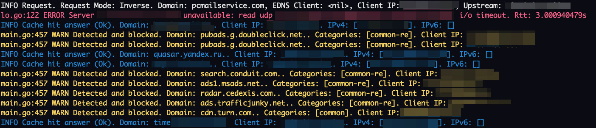

# What is OpenBLD.net Gears?

OpenBLD.net Gears is a set of tools and services that help you to protect your online privacy and security. 

## Gears

- **Private DNS Profiling (PDP)**: A service that provides complete isolation of your DNS requests, ensuring that no one can track your online activity. It also offers personalized DNS settings, robust security with DNSSEC, TLSv1.2, and TLSv1.3, and more.
- **Differentiated DNS Switching (ADDS)**: Differentiated DNS switching to faster upstream servers for priority (trusted) domain names.
- **Multi Output Channeling (MOC)**: Different channeling for different output data.
- **Custom Terminal Messages (CTM)**: Allow customizing terminal messages for `nslookup` etc.
- **Guarantee DNS Resolving System (GDRS)**: A system that guarantees the resolution of DNS requests if those are not resolved by the upstream DNS servers.
- **Upstream Fly Selector (UFS)**: A service that automatically switches to available upstream servers, according selected balancing mode.
- **DNS Filtering (DF)**: A service that filters DNS requests based on the user's preferences.
- **DNS Caching (DC)**: A service that caches DNS requests to speed up the resolution process.
- **Rate Limiting (RL)**: A service that limits the number of DNS requests per second.
- **DNS Type Blocking (DTB)**: A service that blocks specific DNS request types.
- **Blocklists with Categories (BLC)**: A service that blocks unwanted content based on categories.
- **Rsyslog forwarding (RSF)**: A service that forwards logs to the remote syslog server.
- **EDNS Client Subnet (ECS)**: A service that provides the client's subnet information to the upstream DNS servers.
- **Metrics Collection (MC)**: A service that collects metrics about DNS requests and responses.
- **Dashboard System (DS)**: A system that provides a dashboard with metrics data.

## Modes

OpenBLD.net Gears offers several modes to help to customize your online experience and available as default settings in:

- **ADA - Adaptive DNS Acceleration**: A mode that automatically switches to faster upstream servers for priority (trusted) domain names.
- **RIC - Strict DNS Concentration**: A mode that allows majority DNS requests to the OpenBLD.net servers from PDP Gear. All other DNS requests are blocked.
- **KID - Kid Protection Mode**: A mode that blocks adult content, gambling, and other unwanted content.
- **ZTM - Zero Trust Mode**: A mode that blocks all DNS requests except for those explicitly allowed by the user.

## Dashboard

All metrics data compatible with Prometheus and Grafana.

## Rate Limiting

Service that limits the number of DNS requests per second and can be configured based on the user's preferences.

Options:

- **Per IP Address**: Limits the number of DNS requests per second per IP address.
- **Per Byte**: Limits the number of DNS requests per second per byte.
- **Per NXDOMAIN**: Limits the number of DNS requests per second per NXDOMAIN.
- **Block by Query Type**: Limits the number of DNS requests per second per query type.
- **Blocking Threshold**: Blocks the IP address if the number of DNS requests per second exceeds the threshold.
- **Blocking Time**: The time the IP address is blocked if the number of DNS requests per second exceeds the threshold.
- **Whitelist**: Allows specific IP addresses and CIDR's to bypass the rate limiting.

## Filtering

- Local and Remote file loading
- Regular expressions
- Domain lists
- Downloading interval

## Caching

- Response caching
- Different cache storing time for different DNS responses
- Enrichment cache with additional information (categories)
- Automatic cache cleaning
- Domain matching cache

## Logging

- Asynchronous logging
- Forward logs to the remote syslog server
- Enriches the blocked domains with additional information (categories).
- Colorized logs

## Modes

- Zero Trust Mode (ZTM): A mode that blocks all DNS requests except for those explicitly allowed by the user.
- Blackhole Mode (BHM): A mode that blocks all DNS requests, based on blocklists.

:::tip
The user can enable this mode optionally.
:::

## Additional Information

:::important
* It its own internal technologies of OpenBLD.net which can be provided to users as a service in [OpenBLD Plus](/docs/overwiew/openbld-plus/) mode.
* Not all technologies are available for public use.
* These technologies are **not used** in public services:
  * no metrics 
  * no logs (see _How it works_)
  * no data collection
  * no data selling
  * no data analysis
  * no central data storage, 
  * no data aggregation
  * see [How it works](/docs/overwiew/how-it-works/) for more details.
:::

