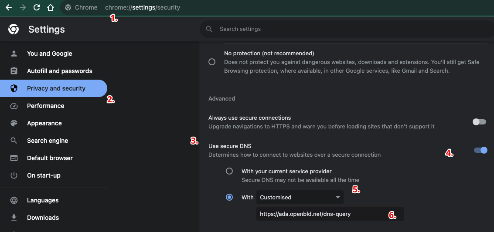

# Google Chrome

Google Chrome браузерінде жарнаманы және бақылауды бұғаттау үшін қауіпсіз DNS over HTTPS баптау қажет.

Google Chrome-да OpenBLD.net баптау

1. Браузер терезесіндегі үш нүктеден мәзірді шертіп басу (Баптаулар Мәзірі)
2. Баптауларды таңдау
3. Құпиялылық және Қауіпсіздік > Қауіпсіздікке дейін айналдыру
4. Төмен қарай айналдыру және қауіпсіз DNS пайдалануды қосу
5. Ашылатын мәзірде Пайдаланушы режимін таңдау
6. Мекенжайды көрсету: `https://ada.openbld.net/dns-query`

## Мысал



Жәй ғана көшіріп алып, осы сілтемені өз браузеріңіздің баптауына қойыңыз:

```shell
https://ada.openbld.net/dns-query
```

## Chrome үшін OpenBLE.net кеңейту

Қосымша опция ретінде сіз Google Chrome браузері үшін кеңейтуді пайдалана аласыз:

* Google Chrome және Brave браузері үшін [OpenBLD.net Blocker](/docs/get-started/setup-browsers/extensions/) кеңейтуді орнатыңыз.
