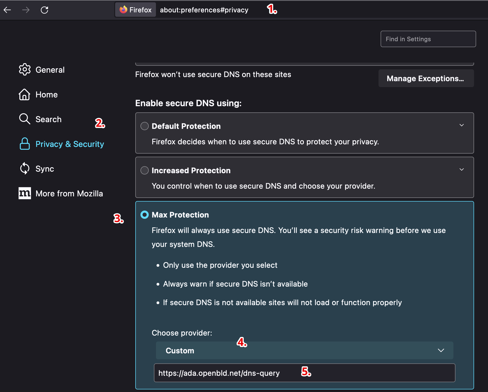

# Mozilla Firefox

Mozilla Firefox-та OpenBLD.net баптау

1. Мәзір батырмасын басыңыз және «Баптауларды» таңдаңыз.
2. Сол жақ панельдің мәзірінде Құпиялылық және қауіпсіздікті таңдаңыз.
3. Қауіпсіз DNS > Ең жоғары қорғауды іске қосу тармағына дейін төмен қарай айналдырыңыз.
4. жеткізушіні > Пайдаланушылық таңдаңыз.
5. Мекенжайды көрсетіңіз: `https://ada.openbld.net/dns-query`

## Мысал



Жәй ғана көшіріп алып, осы сілтемені өз браузеріңіздің баптауына қойыңыз:

```shell
https://ada.openbld.net/dns-query
```


